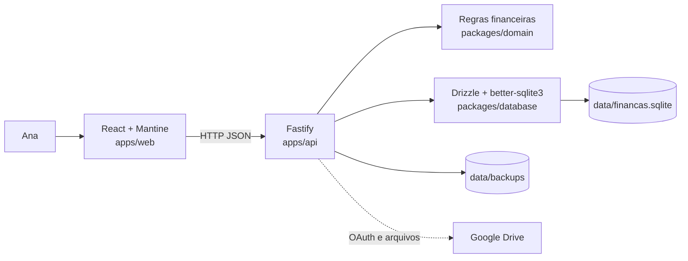

# ARCHITECTURE.md

> Gerado por `ana-repo-bootstrap` v0.5. Evidência de código + entrevista.

**Produto:** Carteira da Ana  
**Perfil:** Node.js/TypeScript em monorepo  
**Atualizado:** 2026-07-10

## Visão geral

Carteira da Ana é uma aplicação local de finanças pessoais. A interface React consulta uma API Fastify por HTTP; a API coordena regras financeiras de `packages/domain` e persiste dados em um banco SQLite por meio de `packages/database`. O Controle mensal é o fluxo principal do produto, agregando orçamentos, lançamentos, contas e faturas nas visões de competência e caixa.

## Componentes

| Componente | Path | Responsabilidade | Depende de |
| --- | --- | --- | --- |
| Interface web | `apps/web` | Exibir páginas, capturar ações e consumir a API local | React, Mantine, domínio, API HTTP |
| API local | `apps/api` | Registrar rotas, validar entradas, coordenar regras e persistência | Fastify, domínio, database |
| Domínio financeiro | `packages/domain` | Regras puras de dinheiro, datas, lançamentos, faturas e conciliação | TypeScript |
| Persistência | `packages/database` | Schema, conexão, migrations, seeds, integridade e restauração SQLite | Drizzle ORM, better-sqlite3 |
| Compartilhado | `packages/shared` | Espaço para contratos compartilhados; atualmente mínimo | TypeScript |
| Banco principal | `data/financas.sqlite` | Persistir os dados financeiros locais | SQLite |
| Backups locais | `data/backups` | Armazenar backups manuais e pontos pré-restauração | API, SQLite |

## Fluxos críticos

### 1. Controle mensal

1. `ControleMensalPage` mantém o mês selecionado e alterna entre competência e caixa.
2. A interface consulta `GET /controle-mensal?month=YYYY-MM&view=competence|cash`.
3. `registerBudgetRoutes` carrega orçamentos, lançamentos, contas, categorias, cartões e faturas.
4. As classificações de `packages/domain/src/financial-classification.ts` distinguem consumo, movimento de conta, compra no crédito, pagamento de fatura e transferência.
5. A visão de competência agrupa valores planejados, realizados, comprometidos e disponíveis por categoria e subcategoria.
6. A visão de caixa calcula entradas, saídas, saldos por conta, compromissos de fatura e projeções.
7. `ControleMensalPage` e `CashMonthlyView` apresentam os resultados e permitem atualizar planejamentos por `PUT /budgets`.
8. Transferências internas e pagamentos de fatura não geram novo consumo econômico.
9. Compras no cartão afetam o orçamento pelo mês da fatura, não pela data de saída da conta.

Esse é o fluxo mais importante do produto. A avaliação da usuária é que sua experiência ou resultado ainda não está bom; os problemas específicos precisam ser levantados antes de qualquer redesenho.

### 2. Compra no cartão e pagamento da fatura

1. A compra é criada pelas rotas de transações ou pelas rotas específicas de cartão.
2. `getCreditCardBillMonth` calcula o mês da fatura usando a data da compra e o dia de fechamento.
3. `getOrCreateCreditCardBill` localiza ou cria a fatura do cartão e mês calculado.
4. A compra persiste com `creditCardId`, sem `accountId` e sem `paymentMethodId`.
5. Compras parceladas são expandidas em lançamentos mensais; a diferença de centavos fica na última parcela.
6. A fatura soma somente as compras correspondentes, sem incluir seu próprio pagamento.
7. Ao pagar, a API marca a fatura como `paid` e cria ou atualiza um lançamento de despesa associado à conta pagadora.
8. O pagamento movimenta o saldo da conta, mas `isCreditCardPayment` impede que ele seja contado novamente como consumo.
9. Antes de editar ou excluir compras, a API aplica as restrições de fatura paga cobertas por testes.

### 3. Importação e conciliação CSV

1. A interface lê o arquivo local e permite mapear data, descrição, valor, tipo, categoria e outros campos.
2. A prévia é enviada às rotas de importação ou a `POST /reconciliation/match-preview`.
3. A API interpreta delimitador, datas, moeda, parcelas e direção financeira.
4. A detecção de duplicidade compara conta ou cartão, valor, descrição, data próxima e mês da fatura, conforme o tipo de importação.
5. Na conciliação, `calculateMatchScore` classifica candidatos como correspondência exata, provável ou inexistente.
6. A usuária escolhe conciliar, criar ou ignorar cada item.
7. A confirmação persiste apenas os itens selecionados e volta a aplicar a prevenção de duplicidades.
8. Importações de cartão criam despesas sem conta ou meio de pagamento e podem projetar parcelas futuras.

## Integrações externas

| Sistema | Usado por | Observações |
| --- | --- | --- |
| Google Drive API | `apps/api/src/modules/settings.ts` | Lista, envia e baixa backups; exige OAuth e acesso de rede |
| Google OAuth 2.0 | API e tela de configurações | Usa callback local em `http://localhost:3000/auth/google/callback` |
| Sistema de arquivos local | Banco e backups | Banco em `data/financas.sqlite`; backups em `data/backups/` |
| Navegador local | `apps/web` | Interface atualmente servida por Vite em `localhost:5173` |

Não há serviço remoto obrigatório para o funcionamento financeiro principal.

## Decisões arquiteturais

- O produto funciona localmente e usa SQLite como fonte principal de dados.
- Valores monetários são persistidos como centavos inteiros.
- Datas de negócio usam `YYYY-MM-DD`; competências usam `YYYY-MM`.
- Compras no cartão não movimentam contas no momento da compra.
- Transferências são representadas por dois lançamentos vinculados e não constituem consumo.
- Categorias preservam histórico por identificadores internos.
- Arquivamento não equivale a exclusão e deve admitir restauração quando aplicável.
- Meios de pagamento são dados semeados, sem CRUD próprio.
- API, interface, domínio e banco pertencem à mesma aplicação local.
- A distribuição futura — aplicação web ou desktop empacotada — ainda não foi decidida.

## Lacunas

- O Controle mensal precisa de avaliação funcional e visual antes que seus problemas sejam especificados.
- A estratégia de distribuição futura entre web e desktop permanece aberta.
- Reservas possuem schema, mas não têm API nem interface.
- Importação OFX não está implementada.
- A integração real com Google Drive não foi validada nesta análise.
- Não há gate de cobertura de testes configurado.
- A documentação existente apresenta informações desatualizadas sobre backups.
- O ambiente desta análise não atende ao Node mínimo e não possui `pnpm`, impedindo a execução das verificações.
