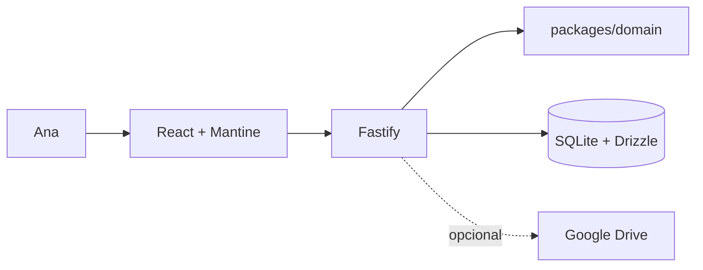

# Arquitetura

**Produto:** Carteira da Ana  
**Atualizado:** 2026-07-13

## Visão geral

A aplicação React local consulta uma API Fastify. A API coordena regras puras de domínio e persiste em SQLite com Drizzle. Google Drive é opcional e usado apenas para backups.

| Camada | Caminho | Responsabilidade |
| --- | --- | --- |
| Interface | `apps/web` | Navegação, formulários e visualizações mensais |
| API | `apps/api` | Contratos HTTP, serviços de aplicação e transações |
| Domínio | `packages/domain` | Dinheiro, datas e classificação financeira puramente testáveis |
| Persistência | `packages/database` | Schema, migrations, conexão, integridade e backup SQLite |

## Fluxos críticos

### Visão do mês

1. `MonthlyOverviewPage` consulta `GET /monthly-overview` para o mês compartilhado.
2. `monthly-overview-service` reúne orçamento e lançamentos.
3. O domínio calcula planejado, gasto, disponível e acima do planejado.
4. `PUT /monthly-budgets` mantém uma alocação por mês e subcategoria.
5. Parcelas contam no mês da fatura; transferências e pagamentos não duplicam gasto.

### Dinheiro nas contas

1. `AccountsCashView` consulta `GET /cash-position`.
2. O serviço combina saldos realizados, orçamento restante por origem, previsões recorrentes e faturas sem duplicar eventos.
3. Previsões não persistem lançamentos até confirmação.
4. Pagamentos de fatura e transferências movimentam caixa com rastreabilidade própria.

### Transferência atômica

1. A interface envia origem, destino, valor e data a `POST /transfers`.
2. `transfer-service` grava `account_transfers` e duas pernas em uma transação SQLite.
3. As pernas carregam `transferId`; edição e exclusão atualizam o agregado inteiro.
4. Classificadores excluem ambas do consumo econômico.

### Compra e pagamento de fatura

1. A compra preserva `eventDate`; o fechamento define `budgetMonth` e a fatura.
2. Parcelas são lançamentos separados nos meses das respectivas faturas.
3. `POST /credit-cards/:id/bills/:billId/payments` registra principal, juros, multa, conta e data com idempotência.
4. O pagamento gera movimento de caixa e o estado da fatura é derivado do histórico.
5. Reversões são explícitas; fatos pagos bloqueiam mudanças financeiras.

### Recorrência

1. Uma regra mensal gera somente previsões na leitura.
2. A confirmação idempotente cria a ocorrência em conta ou cartão.
3. Pausa, retomada e encerramento não reescrevem ocorrências passadas.

### Importação simples

1. O navegador interpreta o CSV e envia linhas normalizadas a `/simple-import/preview`.
2. A usuária revisa, corrige em lote e escolhe linhas; duplicatas começam desmarcadas.
3. `/simple-import/confirm` aplica o contrato normal de criação em uma transação atômica.
4. Não há conciliador bancário no fluxo canônico.

## Persistência e segurança local

- Valores são centavos inteiros e datas de negócio não dependem de UTC.
- O protótipo usa uma baseline canônica. O reset destrutivo exige ambiente de desenvolvimento/UAT, caminho explícito dentro da raiz permitida e confirmação `RESET`.
- O banco principal e backups ficam fora do Git.
- A restauração cria um ponto de segurança antes de alterar o banco conectado.

## Limites atuais

- Produto e dados financeiros funcionam localmente; Drive não é obrigatório.
- Escopo monetário: BRL.
- Patrimônio, investimentos/rentabilidade, dívidas e relatórios prescritivos estão no backlog.
- Distribuição futura como web ou desktop continua aberta.
