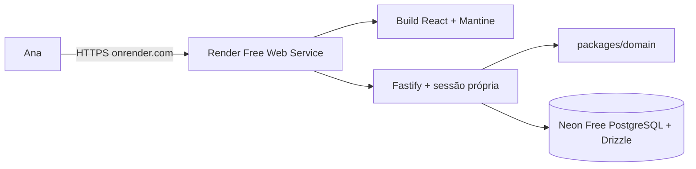

# Arquitetura

**Produto:** Carteira da Ana  
**Atualizado:** 2026-07-27

## Visão geral

No protótipo, a aplicação React local consulta uma API Fastify, que coordena regras puras de domínio e persiste em SQLite com Drizzle. No release online inicial, um Render Free Web Service servirá o build React/Vite e a API Fastify na mesma origem; a API autenticará Ana por usuário e senha e persistirá no Neon Free PostgreSQL. Google Drive não participará do release.

| Camada       | Caminho             | Responsabilidade                                               |
| ------------ | ------------------- | -------------------------------------------------------------- |
| Interface    | `apps/web`          | Navegação, formulários e visualizações mensais                 |
| API          | `apps/api`          | Contratos HTTP, serviços de aplicação e transações             |
| Domínio      | `packages/domain`   | Dinheiro, datas e classificação financeira puramente testáveis |
| Persistência | `packages/database` | Schema, migrations, conexão, integridade e backup SQLite       |

O diagrama representa o alvo decidido no ADR 002. Os planos gratuitos e seus limites precisam ser confirmados pela prova de implantação antes da implementação; o protótipo continua usando SQLite local.

## Fronteiras da arquitetura online

- O navegador nunca acessa o banco nem recebe segredos de servidor.
- Toda rota financeira exige identidade e autorização por proprietária no servidor.
- A preferência é web e API sob a mesma origem; se forem separadas, CORS usa allowlist explícita.
- Configuração varia por ambiente, é validada na inicialização e usa a URL `*.onrender.com` atribuída ao serviço em produção.
- Banco, backups e arquivos importados não dependem do filesystem efêmero da aplicação.
- Logs e telemetria não incluem valores financeiros, conteúdo importado, tokens ou credenciais.
- Migrations são executadas como etapa controlada de deploy, com rollback e recuperação documentados.

## Fluxos críticos

### Visão do mês

1. `MonthlyOverviewPage` consulta `GET /monthly-overview` para o mês compartilhado.
2. `monthly-overview-service` reúne orçamento e lançamentos.
3. O domínio calcula planejado, gasto, disponível e acima do planejado.
4. `PUT /monthly-budgets` mantém uma alocação por mês e subcategoria.
5. Parcelas contam no mês da fatura; transferências e pagamentos não duplicam gasto.

### Dinheiro nas contas

1. `AccountsCashView` consulta `GET /cash-position`.
2. O serviço combina saldos realizados, orçamento restante por origem, previsões recorrentes e faturas sem duplicar eventos.
3. Previsões não persistem lançamentos até confirmação.
4. Pagamentos de fatura e transferências movimentam caixa com rastreabilidade própria.

### Transferência atômica

1. A interface envia origem, destino, valor e data a `POST /transfers`.
2. `transfer-service` grava `account_transfers` e duas pernas em uma transação SQLite.
3. As pernas carregam `transferId`; edição e exclusão atualizam o agregado inteiro.
4. Classificadores excluem ambas do consumo econômico.

### Compra e pagamento de fatura

1. A compra preserva `eventDate`; o fechamento define `budgetMonth` e a fatura.
2. Parcelas são lançamentos separados nos meses das respectivas faturas.
3. `POST /credit-cards/:id/bills/:billId/payments` registra principal, juros, multa, conta e data com idempotência.
4. O pagamento gera movimento de caixa e o estado da fatura é derivado do histórico.
5. Reversões são explícitas; fatos pagos bloqueiam mudanças financeiras.

### Recorrência

1. Uma regra mensal gera somente previsões na leitura.
2. A confirmação idempotente cria a ocorrência em conta ou cartão.
3. Pausa, retomada e encerramento não reescrevem ocorrências passadas.

### Importação simples

1. O navegador interpreta o CSV e envia linhas normalizadas a `/simple-import/preview`.
2. A usuária revisa, corrige em lote e escolhe linhas; duplicatas começam desmarcadas.
3. `/simple-import/confirm` aplica o contrato normal de criação em uma transação atômica.
4. Não há conciliador bancário no fluxo canônico.

## Persistência e segurança

- Valores são centavos inteiros e datas de negócio não dependem de UTC.
- O protótipo usa uma baseline canônica. O reset destrutivo exige ambiente de desenvolvimento/UAT, caminho explícito dentro da raiz permitida e confirmação `RESET`.
- O banco principal e backups ficam fora do Git.
- A restauração cria um ponto de segurança antes de alterar o banco conectado.
- Esses controles locais não bastam para produção: a arquitetura online adicionará identidade, escopo de propriedade, segredos gerenciados, HTTPS, backups externos e observabilidade.

## Limites atuais

- Produto e dados financeiros funcionam hoje localmente; a implantação online ainda não está pronta para produção.
- Escopo monetário: BRL.
- Patrimônio, investimentos/rentabilidade, dívidas e relatórios prescritivos estão no backlog.
- Distribuição será web online; não haverá executável.
- Render, Neon PostgreSQL, autenticação própria e acesso privado estão decididos; apenas a política final de retenção depende da validação dos recursos gratuitos. O plano e a estimativa estão em `.specs/project/ONLINE-MIGRATION.md`.
