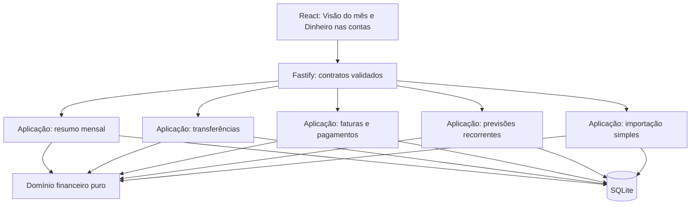

# Design — Fundação mensal da Carteira da Ana

**Spec:** `.specs/features/monthly-foundation/spec.md`
**Status:** approved
**Criado em:** 2026-07-13

---

## Visão de arquitetura

O redesenho separa três responsabilidades que hoje aparecem misturadas: planejamento e consumo do
mês, movimentação real das contas e previsão de eventos futuros. A interface usa linguagem simples;
competência e caixa permanecem regras internas do domínio.



### Regra mental canônica

- **Planejamento:** quanto a usuária decidiu gastar no mês.
- **Gasto:** compra ou cobrança que já aconteceu, independentemente de já ter sido paga.
- **Caixa:** momento em que dinheiro efetivamente entra ou sai de uma conta.
- **Previsão recorrente:** evento futuro que ainda não aconteceu e, portanto, ainda não é gasto.
- **Parcela futura:** obrigação de uma compra já realizada; consome o planejamento no mês da sua fatura.

Compra no cartão é gasto no mês da respectiva fatura. O pagamento da fatura é somente movimento de
caixa e não cria um segundo gasto.

---

## Análise de reuso

| Componente existente | Local | Como usar |
| --- | --- | --- |
| Datas civis e meses | `packages/domain/src/dates.ts` | Reusar validação, avanço de mês e ajuste para o último dia. |
| Regras de fatura | `packages/domain/src/credit-card-bills.ts` | Calcular fatura de compras, parcelas e cobranças recorrentes realizadas. |
| Classificação financeira | `packages/domain/src/financial-classification.ts` | Preservar distinção entre consumo, caixa, transferência e pagamento. |
| Parcelamentos estruturados | `installment_purchases` e `installments` | Manter parcelas como obrigações finitas, sem reutilizá-las para recorrências. |
| Transações SQLite | `transactions.ts` e `credit-cards.ts` | Reusar o padrão `db.transaction`, tornando-o obrigatório nos agregados financeiros. |
| Seletor de mês | `apps/web/src/app/shared/MonthSelector.tsx` | Compartilhar entre as duas visões. |
| Campos rápidos | `QuickEditFields.tsx` | Basear a edição inline do orçamento, com política própria para zero. |
| Categoria e data | `CategorySelect.tsx` e `BusinessDateInput.tsx` | Reusar em lançamentos, importação e metadados de fatura. |
| CSV compartilhado | `apps/web/src/app/shared/csv-utils.ts` | Centralizar parsing e detecção hoje duplicados. |
| Edição em lote da prévia | `transactions/import-preview.ts` | Reusar no fluxo simples de conferência. |

### Duplicações a eliminar quando forem tocadas

- Extrair `AccountMonthlySummary`, repetido em `ControleMensalPage` e `CashMonthlyView`.
- Unificar a tabela de saldos e projeção por conta em `AccountBalanceTable`.
- Centralizar `getAccountTypeLabel` em `shared/account-ui.ts`.
- Criar contratos compartilhados e validados para conta, cartão, meio e respostas mensais.
- Criar `shared/api-client.ts` para URL, timeout, parsing e erros HTTP.
- Remover o parser CSV duplicado do conciliador.
- Unificar prévia/confirmação de CSV de lançamentos e faturas em um hook configurável.
- Centralizar `getAccountDelta`, hoje repetido entre domínio, contas e orçamento.

---

## Componentes

### Casos de uso do domínio

- **Propósito:** manter cálculos financeiros puros fora de rotas e componentes React.
- **Local:** `packages/domain/src/`
- **Componentes:** `monthly-overview.ts`, `transfers.ts`, `bill-payments.ts`, `recurrences.ts`.
- **Dependências:** tipos de dinheiro/data e classificação financeira existentes.
- **Regra:** nenhuma função pura acessa HTTP ou SQLite.

### Serviços de aplicação da API

- **Propósito:** orquestrar validação, domínio e persistência atômica.
- **Local:** `apps/api/src/application/`
- **Componentes:** `monthly-overview-service.ts`, `transfer-service.ts`,
  `bill-payment-service.ts`, `recurrence-service.ts`, `transaction-import-service.ts`.
- **Regra:** handlers Fastify validam a borda e delegam; não concentram cálculos financeiros.

### Frontend mensal

```text
monthly-control/MonthlyOverviewPage.tsx
├─ MonthAtGlance.tsx
│  ├─ MonthlyHealthSummary.tsx
│  ├─ BudgetCategoryTable.tsx
│  └─ InlineBudgetAmount.tsx
└─ AccountsCashView.tsx
   ├─ CashPositionSummary.tsx
   ├─ AccountBalanceTable.tsx
   └─ UpcomingCashCommitments.tsx
```

- `Visão do mês` mostra planejado, gasto e disponível; `Acima do planejado` é situação visual.
- `Dinheiro nas contas` mostra saldo atual, entradas/saídas previstas, faturas e saldo esperado.
- Estado vazio oferece ações contextuais, sem onboarding.
- Detalhes por fonte/meio não aparecem no fluxo principal.

### Importação simples

```text
transactions/SimpleCsvImportDialog.tsx
├─ CsvFileStep.tsx
└─ ImportReviewTable.tsx
```

- Passo 1: arquivo e conta/cartão de destino.
- Passo 2: revisão, correções e confirmação.
- Mapeamento aparece apenas quando a detecção não for suficiente.
- Conciliação por correspondência não participa do fluxo padrão e pode ser removida na migração.

---

## Modelos de dados

### Orçamento

O orçamento canônico deixa de depender de conta e meio de pagamento.

```text
budgets
├─ id
├─ budgetMonth
├─ subcategoryId NOT NULL
├─ amountCents > 0
├─ createdAt
└─ updatedAt

UNIQUE (budgetMonth, subcategoryId)
```

- Categoria é agregação de subcategorias.
- Orçamento geral não escolhe arbitrariamente a primeira subcategoria.
- Valores antigos detalhados por conta/meio podem ser descartados na migração destrutiva.

### Transferência

```text
account_transfers
├─ id
├─ sourceAccountId
├─ destinationAccountId
├─ amountCents
├─ eventDate
├─ description
├─ status
├─ createdAt
└─ updatedAt
```

`transactions` recebe `transferId`. O agregado e suas duas pernas são gravados, alterados e
excluídos na mesma transação SQLite.

Invariantes:

- origem diferente do destino;
- valor inteiro e positivo;
- exatamente duas pernas equivalentes;
- uma saída na origem e uma entrada no destino;
- nenhuma perna é consumo ou renda.

### Pagamentos de fatura

```text
credit_card_bill_payments
├─ id
├─ billId
├─ accountId
├─ paymentTransactionId
├─ paymentDate
├─ principalCents
├─ interestCents
├─ penaltyCents
├─ notes
├─ reversedAt
├─ createdAt
└─ updatedAt
```

`credit_card_bills` recebe `minimumDueCents` e `closedAt`. A situação é derivada do total, principal
pago, vencimento e reversões: `open`, `partial`, `paid` ou `overdue`.

Regras:

- pagamento exige data real e conta ativa;
- `principal + interest + penalty` é o total que sai da conta;
- juros e multa são despesas próprias, não parte das compras;
- mínimo, juros e multa são informados manualmente;
- pagamento acima do saldo restante é rejeitado;
- qualquer pagamento ativo bloqueia valor, data, tipo, cartão, fatura, competência e parcelas;
- descrição, subcategoria e observações continuam editáveis;
- correção financeira exige reverter pagamentos, corrigir e pagar novamente.

### Recorrências

```text
recurrence_rules
├─ id
├─ kind: income | expense
├─ description
├─ amountCents
├─ subcategoryId
├─ accountId XOR creditCardId
├─ paymentMethodId nullable
├─ frequency: monthly
├─ dayOfMonth
├─ startMonth
├─ endMonth nullable
├─ status: active | paused | ended
├─ createdAt
└─ updatedAt
```

Recorrência não materializa meses futuros como transações `planned`. O serviço calcula previsões em
leitura. Quando a cobrança ou receita acontece, cria uma transação real com `recurrenceRuleId` e
`recurrenceMonth`; a chave parcial única evita duplicação.

- Dia 29–31 é ajustado ao último dia do mês.
- Conta: a previsão afeta apenas `Dinheiro nas contas`; a ocorrência confirmada afeta caixa e gasto/receita.
- Cartão: a previsão usa fechamento e vencimento; a cobrança confirmada entra na respectiva fatura.
- Alterar `esta e as próximas` encerra a regra anterior e cria outra.
- Pausar ou encerrar remove previsões futuras sem apagar fatos passados.
- Parcelamento permanece separado e finito.

---

## Contratos HTTP

Toda entrada usa schema Zod com `safeParse` no handler.

### Controle mensal

```text
GET /monthly-overview?month=YYYY-MM
GET /cash-position?month=YYYY-MM
PUT /budgets
POST /budgets/copy
```

`MonthlyOverview` retorna receitas, gastos, orçamento e categorias em centavos. `CashPosition`
retorna contas, saldo atual, entradas/saídas previstas, faturas e saldo esperado. Os dois contratos
permanecem separados para evitar um payload único excessivo.

### Transferências

```text
POST   /transfers
PUT    /transfers/:id
PATCH  /transfers/:id/metadata
DELETE /transfers/:id
```

### Faturas

```text
POST /credit-cards/:cardId/bills/:billId/payments
POST /credit-cards/:cardId/bills/:billId/payments/:paymentId/revert
PATCH /credit-cards/:cardId/bills/:billId/transactions/:transactionId/metadata
```

O GET da fatura retorna total de compras, principal pago, encargos, saldo restante, mínimo,
satisfação do mínimo, situação e pagamentos.

### Recorrências

```text
GET    /recurrences
POST   /recurrences
PUT    /recurrences/:id
POST   /recurrences/:id/pause
POST   /recurrences/:id/resume
DELETE /recurrences/:id
POST   /recurrences/:id/confirm-occurrence
```

### Importação

```text
POST /transactions/import-preview
POST /transactions/import-confirm
```

A confirmação valida cada item pelo mesmo contrato da criação manual e retorna contagens de
criados, duplicados ignorados e inválidos.

---

## Estratégia de erro

| Cenário | Tratamento | Resposta |
| --- | --- | --- |
| Payload, data ou valor inválido | Zod + validações de domínio | `400`, sem escrita |
| Conta, fatura, categoria ou regra inexistente | Falha explícita | `404` |
| Mesma conta, pagamento excessivo ou edição bloqueada | Conflito de domínio | `409` |
| Falha durante transferência/pagamento | Rollback da transação inteira | `500` com log estruturado |
| Resposta API inválida no frontend | Rejeitar schema; não converter para zero/vazio | Alerta recuperável |
| Falha ao salvar orçamento | Preservar valor anterior e manter edição | Erro inline |
| Falha incerta na importação | Não reenviar automaticamente | Modal permanece aberto |
| Troca de mês durante GET | Cancelar requisição anterior | Sem sobrescrever mês atual |

- GET pode repetir somente erros transitórios e com limite configurado.
- Mutações financeiras não têm retry automático; quando necessário, usam chave de idempotência.
- Erros internos preservam `cause` e contexto sem expor dados financeiros sensíveis.

---

## Migração destrutiva do protótipo

Compatibilidade com o modelo atual não é requisito. A migração pode recriar tabelas, remover rotas e
descartar estruturas ambíguas, porque a aplicação ainda não está em produção.

Sequência:

1. Criar backup automático obrigatório do banco atual.
2. Executar `PRAGMA integrity_check` no banco e no backup.
3. Extrair somente dados simples e determinísticos que serão preservados.
4. Recriar as tabelas diretamente no modelo novo.
5. Migrar contas, categorias, transações, parcelas, faturas e demais dados confiáveis.
6. Descartar orçamentos ambíguos por conta/meio e exigir novo planejamento.
7. Migrar transferências somente quando o par for completo; pares quebrados são reportados e descartados.
8. Migrar pagamentos antigos como principal, encargos zero e data igual ao lançamento existente.
9. Remover contratos antigos de conciliação, orçamento detalhado e pagamento inferido.
10. Validar contagens, saldos, faturas, transferências e integridade referencial.
11. Se qualquer validação falhar, interromper e restaurar o backup.

Migração destrutiva de schema e descarte explícito de dados ambíguos são permitidos. Perda silenciosa
de dados financeiros continua proibida.

---

## Decisões técnicas

| Decisão | Escolha | Por quê |
| --- | --- | --- |
| Orçamento | Mês + subcategoria | Menor atrito e chave sem ambiguidade. |
| Compra no cartão | Gasto no mês da fatura | Separa consumo mensal do pagamento em conta. |
| Parcela futura | Obrigação já assumida | Cada parcela consome o mês da própria fatura. |
| Recorrência futura | Previsão, não gasto | O evento ainda não aconteceu. |
| Recorrência x parcela | Modelos separados | Uma é repetição aberta; a outra é obrigação finita. |
| Transferência | Agregado explícito + duas pernas | Atomicidade e integridade verificável. |
| Fatura | Pagamentos próprios e múltiplos | Suporta parcial, mínimo, encargos e reversão. |
| Fatura fechada | Bloqueia campos financeiros | Evita alteração retroativa de obrigação. |
| Migração | Destrutiva com backup | Protótipo não precisa carregar compatibilidade antiga. |
| Importação | Prévia e conferência simples | Matching sofisticado não é requisito atual. |

---

_Próxima fase: `tasks.md`, necessária porque o Design envolve mais de cinco entregas dependentes._
