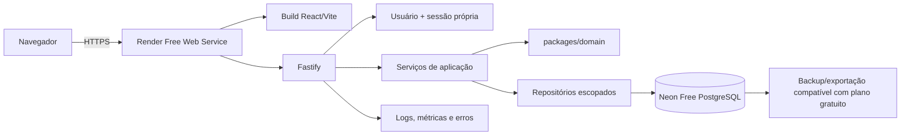

# Design — Distribuição online da Carteira da Ana

**Especificação:** `.specs/project/ONLINE-MIGRATION.md`

**Decisões:** `.specs/codebase/decisions/001-distribuicao-online.md` e `.specs/codebase/decisions/002-arquitetura-release-online-inicial.md`

**Status:** approved

**Criado em:** 2026-07-27

---

## Objetivo do design

Transformar o protótipo local em uma aplicação web hospedada sem reescrever as regras financeiras. O design preserva React/Vite, Fastify, Drizzle e a separação entre interface, API, domínio e persistência, mas introduz as fronteiras obrigatórias de identidade, propriedade dos dados, configuração de produção, banco hospedado, recuperação e observabilidade.

As decisões do release inicial estão registradas no ADR 002: Render Free Web Service, Neon Free PostgreSQL, autenticação própria somente para Ana, sem domínio próprio e sem Google Drive.

## Decisões do release inicial

O primeiro release será **privado para Ana, sem cadastro público**. Mesmo nesse caminho, todos os dados recebem `ownerId`; isso evita uma migração estrutural futura e garante autorização no servidor.

- autenticação própria por usuário e senha, sem OAuth;
- senha persistida exclusivamente como hash Argon2id;
- sessão opaca persistida como hash e enviada por cookie seguro;
- Render Free Web Service servindo Fastify e o build Vite na mesma origem;
- Neon Free PostgreSQL;
- URL gratuita `*.onrender.com`, sem domínio próprio;
- nenhuma restrição de região, preferindo proximidade entre Render e Neon quando gratuita;
- Google Drive fora do release;
- OAuth Google, multiusuário e domínio próprio no backlog.

T1 continua bloqueante somente para comprovar que os limites gratuitos vigentes atendem ao mínimo. Planos gratuitos não constituem garantia permanente; qualquer custo exige nova aprovação.

---

## Análise de reuso

| Componente existente       | Local                                                     | Uso no design online                                                                                   |
| -------------------------- | --------------------------------------------------------- | ------------------------------------------------------------------------------------------------------ |
| Domínio financeiro puro    | `packages/domain/src/`                                    | Preservar cálculos e invariantes; identidade não entra nas funções puras que não consultam dados.      |
| Serviços de aplicação      | `apps/api/src/application/`                               | Receber `RequestContext` autenticado e orquestrar repositórios sempre escopados.                       |
| Módulos Fastify            | `apps/api/src/modules/`                                   | Manter contratos HTTP, adicionando pre-handler de autenticação e autorização.                          |
| Cliente HTTP compartilhado | `apps/web/src/app/shared/api-client.ts`                   | Tornar o único transporte do frontend, com cookies, timeout e erros padronizados.                      |
| Drizzle schema/migrations  | `packages/database/src/` e `packages/database/drizzle/`   | Reaproveitar o modelo conceitual e produzir schema/migrations para o banco escolhido.                  |
| Conexão e integridade      | `packages/database/src/connection.ts`                     | Preservar adapter SQLite no desenvolvimento; introduzir interface de conexão/configuração de produção. |
| Testes financeiros         | `apps/api/src/*.test.ts`, `packages/domain/src/*.test.ts` | Reexecutar como regressão após adicionar propriedade e trocar persistência.                            |
| Backup online SQLite       | `apps/api/src/modules/backups.ts`                         | Reusar apenas como referência de integridade; não expor restauração global na produção.                |
| Google Drive               | `apps/api/src/modules/settings.ts`                        | Remover/desabilitar rotas e interface do release online, preservando o histórico no Git.               |

### Duplicações e acoplamentos a eliminar

- Fallbacks para `http://localhost:3000` aparecem no cliente compartilhado e em múltiplas páginas; toda chamada deve passar por `shared/api-client.ts`.
- Algumas páginas usam `fetch` diretamente e repetem parsing de erro, URL e headers; substituir pelo transporte compartilhado antes de configurar produção.
- Redirects do Google OAuth e do frontend estão fixos em `settings.ts`; removê-los junto da integração no release online.
- Diretórios de backup são resolvidos em mais de um módulo; a produção deve usar uma interface única de armazenamento/backup.
- Configurações globais do Google Drive não devem ser migradas para o PostgreSQL.

---

## Arquitetura-alvo



### Topologia HTTP

- Fastify serve o build Vite e a API na mesma origem `https://<servico>.onrender.com`; rotas da API usam prefixo `/api`.
- Cookies de sessão usam `HttpOnly`, `Secure`, `SameSite=Lax`, `Path=/` e expiração explícita.
- CORS não é necessário na produção de mesma origem; origens de desenvolvimento usam allowlist explícita.
- O proxy encerra TLS e encaminha identidade de rede confiável; a API só confia em proxy configurado.
- `/health/live` verifica processo; `/health/ready` verifica dependências sem expor detalhes ou dados.
- Rotas de negócio, exportação, importação, configurações e administração exigem sessão.

### Ambientes

| Ambiente   | Dados                                                 | Identidade                          | Deploy                      |
| ---------- | ----------------------------------------------------- | ----------------------------------- | --------------------------- |
| local      | SQLite descartável/pessoal explicitamente selecionado | usuária local criada por comando    | `pnpm dev`                  |
| test       | banco efêmero por suíte                               | fixture de usuária e sessão         | CI                          |
| staging    | Neon separado sem dados pessoais reais                | credencial exclusiva de homologação | automático após gates       |
| production | Neon Free PostgreSQL                                  | somente Ana                         | promoção manual e auditável |

Nenhum ambiente compartilha banco, cookies, credenciais ou secrets.

---

## Identidade, sessão e autorização

### Contrato de autenticação

```ts
type RequestContext = {
  ownerId: string;
  userId: string;
  requestId: string;
};
```

- `userId` vem exclusivamente da sessão validada e nunca é aceito do payload da requisição.
- Não existe endpoint de cadastro. Um comando idempotente cria a conta inicial da Ana sem registrar a senha em shell history, seed ou log.
- Login compara o hash Argon2id e retorna a mesma resposta para usuário inexistente ou senha incorreta.
- Rate limiting e atraso progressivo reduzem tentativas de força bruta.
- Mudança de senha exige a senha atual e revoga todas as sessões anteriores.
- O frontend usa `GET /api/session` para descobrir estado autenticado e nunca decide autorização.
- Cada service recebe `RequestContext`; cada consulta ou mutação inclui `ownerId` obtido da sessão.
- Recursos filhos são autorizados por join com sua raiz proprietária, não apenas por comparar um ID recebido.
- Ausência de recurso de outra proprietária responde como não encontrado quando isso reduz enumeração.

### Estratégia de autorização

O primeiro release possui uma única usuária e um único papel funcional, `owner`. Não será criado RBAC genérico antes de existir requisito. Operações operacionais perigosas — migration, restauração integral, bootstrap e reset — não são endpoints da usuária; são comandos protegidos da plataforma.

### Modelo de propriedade

```text
users
├─ id
├─ username
├─ passwordHash
├─ status
├─ passwordChangedAt
├─ createdAt
└─ updatedAt

UNIQUE (username)

sessions
├─ id
├─ userId
├─ tokenHash
├─ expiresAt
├─ lastSeenAt
├─ revokedAt nullable
└─ createdAt

Entidades raiz financeiras
├─ ownerId NOT NULL -> users.id
└─ índices iniciados por ownerId
```

Entidades raiz incluem contas, categorias, cartões, planejamentos, recorrências, importações e configurações. Filhos podem herdar propriedade por FK quando toda leitura faz join seguro, mas tabelas consultadas diretamente devem carregar `ownerId`. A escolha por tabela será documentada na migration; não pode haver consulta financeira sem predicado de propriedade verificável.

Constraints compostas substituem unicidades hoje globais. Por exemplo, nomes ou chaves mensais que possam se repetir entre pessoas usam `UNIQUE (owner_id, ...)`.

---

## API e serviços de aplicação

### Pipeline de requisição

```text
request id
→ headers/limites
→ autenticação
→ resolução de ownerId
→ validação do contrato
→ service com RequestContext
→ repositório escopado
→ resposta sanitizada
→ log sem dado financeiro
```

### Repositórios escopados

Não serão expostos helpers genéricos que aceitem `ownerId` opcional. O contrato mínimo é:

```ts
interface OwnedRepository<T> {
  findById(ownerId: string, id: string): Promise<T | undefined>;
  list(ownerId: string): Promise<T[]>;
}
```

Mutações recebem `ownerId` como argumento obrigatório. Operações entre agregados validam que todas as referências pertencem à mesma proprietária dentro da transação.

### Erros e idempotência

- `401`: sessão ausente ou inválida;
- `403`: ação autenticada explicitamente proibida e que não revela recurso;
- `404`: recurso inexistente ou fora do escopo;
- `409`: conflito de estado/idempotência;
- `422` ou contrato atual equivalente: payload semanticamente inválido;
- `500`: mensagem pública genérica e erro correlacionado pelo `requestId`.

Importações, pagamentos e outras operações sujeitas a retry preservam idempotência dentro de `(ownerId, idempotencyKey)`.

---

## Frontend

### Bootstrap de sessão

```text
App
├─ SessionProvider
│  ├─ estado carregando
│  ├─ tela de acesso
│  └─ aplicação autenticada
└─ ErrorBoundary
```

- O app consulta `/api/session` antes de carregar dados financeiros.
- `401` limpa o estado local de sessão e apresenta nova autenticação.
- Nenhum token de longa duração é salvo em `localStorage`.
- O cliente HTTP usa URL relativa `/api` por padrão em build de produção; `VITE_API_URL` é permitido somente para desenvolvimento/staging explicitamente configurados.
- Valores financeiros não são enviados a ferramentas de analytics ou gravados em logs do navegador.

### Mudança visual mínima

O escopo adiciona somente estados necessários: carregamento inicial, acesso privado, sessão expirada, indisponibilidade e confirmação de exportação/exclusão. Não inclui redesign das páginas financeiras.

---

## Persistência e migração

### Adapter de banco

Drizzle permanece como camada de schema/query. A conexão deixa de depender implicitamente de `process.cwd()` em produção e passa a exigir configuração validada:

```text
DATABASE_DIALECT=sqlite|postgres
DATABASE_URL=<secret de produção>
DATABASE_PATH=<somente local/test>
```

O build de produção falha na inicialização se usar caminho SQLite local sem a decisão explícita que o permita.

### Estratégia de migration

1. criar schema de produção vazio e executar migrations;
2. criar a usuária proprietária de destino;
3. abrir o SQLite de origem somente para leitura;
4. exportar em ordem de dependência, atribuindo `ownerId` internamente;
5. importar em transações/lotes idempotentes;
6. validar contagens, FKs, centavos por tipo/mês e invariantes de transferências/faturas;
7. gerar relatório sem conteúdo financeiro sensível em logs;
8. liberar produção somente após aceite da reconciliação;
9. manter origem e backup pré-migração imutáveis durante a janela de rollback.

O script nunca recebe `ownerId` a partir dos dados legados e nunca altera o SQLite de origem.

### Compatibilidade e deploy

Migrations seguem expansão/contração quando houver tráfego: primeiro adicionar estruturas compatíveis, depois popular, mudar leitura/escrita e somente em release posterior remover legado. Migration destrutiva não roda automaticamente junto ao start da API.

---

## Backup, restauração e ciclo dos dados

### Separação de responsabilidades

- **Backup operacional:** usar os recursos gratuitos vigentes do Neon e complementar com exportação lógica automatizada se necessário para atingir o RPO aprovado.
- **Exportação da usuária:** arquivo baixável e portável dos próprios dados, gerado sob autenticação e com expiração curta.
- **Restauração integral:** runbook operacional, não botão público da aplicação.
- **Google Drive:** removido do release online; seus dados/configurações legados não serão migrados.

As rotas atuais de restaurar SQLite inteiro ficam indisponíveis em produção. A restauração será operacional e fora da interface.

### Objetivos iniciais

- RPO alvo: até 24 horas, limitado aos recursos gratuitos validados na prova.
- RTO alvo: melhor esforço, com meta de até 4 horas; planos gratuitos não oferecem SLA assumido pelo projeto.
- Retenção desejada: 30 dias; a retenção efetiva gratuita será registrada após a prova.
- Um ensaio de restauração em staging antes do go-live e recorrência trimestral.

---

## Funcionalidades adiadas

- Login Google/OAuth.
- Cadastro e suporte multiusuário.
- Domínio próprio.
- Google Drive.

Esses itens exigirão nova especificação e não devem deixar código inativo, secrets ou rotas públicas no release inicial.

---

## Segurança e privacidade

- HTTPS obrigatório na URL fornecida pelo Render; HSTS deve ser validado sem depender de domínio próprio.
- CSP e headers seguros definidos no edge/API.
- Rate limiting por IP e identidade, com limites especiais para login, importação e exportação.
- Limite de tamanho e validação MIME/conteúdo para CSV.
- Proteção contra CSV injection nas exportações.
- Dependências verificadas no CI e imagens/artefatos com versões imutáveis.
- Logs permitem IDs técnicos, duração, rota, status e `requestId`; proíbem descrições, valores, CSV, cookies, tokens e connection strings.
- Exportação, mudança de senha e exclusão exigem confirmação da senha atual.
- Política de privacidade, retenção e resposta a incidente deve existir antes de cadastro público.

### Modelo de ameaças mínimo

| Ameaça                   | Controle principal                         | Teste obrigatório                             |
| ------------------------ | ------------------------------------------ | --------------------------------------------- |
| IDOR entre proprietárias | `ownerId` da sessão em toda query          | duas identidades não acessam IDs uma da outra |
| roubo de sessão          | cookie seguro, expiração e revogação       | cookie/expiração/logout                       |
| força bruta no login     | rate limit e atraso progressivo            | tentativas repetidas são limitadas            |
| vazamento de senha       | Argon2id e ausência em logs                | texto puro nunca é persistido ou registrado   |
| CSRF                     | SameSite + token/origin conforme topologia | mutação cross-origin rejeitada                |
| vazamento em logs        | logger sanitizado                          | payload financeiro/token não aparece no sink  |
| upload abusivo           | limite, parsing seguro e rate limit        | arquivo grande/inválido rejeitado             |
| migration parcial        | transação, reconciliação e rollback        | falha injetada não publica estado parcial     |
| restauração errada       | runbook, ambiente e confirmação forte      | restore ensaiado em staging                   |

---

## Observabilidade e operação

### Sinais mínimos

- disponibilidade e latência HTTP por rota normalizada;
- taxa de `5xx`, falhas de autenticação anormais e saturação;
- conexões/latência do banco e falhas de migration;
- sucesso e idade do último backup;
- exceções correlacionadas por release e `requestId`;
- custo mensal com alertas de limite.

Alertas não carregam payload financeiro. Runbooks cobrem indisponibilidade da API, banco, login, falha de deploy, falha de migration, restauração, mudança emergencial de senha e rotação de segredo.

### Entrega

```text
pull request
→ format + lint + typecheck + unit/integration
→ build imutável
→ deploy staging
→ smoke + migration check
→ aprovação
→ migration production controlada
→ deploy production
→ smoke + monitoramento
→ rollback se necessário
```

---

## Estratégia de testes

| Nível            | Cobertura esperada                                                              |
| ---------------- | ------------------------------------------------------------------------------- |
| unitário         | configuração, senha/sessão, autorização, sanitização e regras puras preservadas |
| integração API   | autenticação, escopo por `ownerId`, referências cruzadas, idempotência e erros  |
| integração banco | migrations, constraints compostas e queries em SQLite local/PostgreSQL alvo     |
| migração         | banco legado representativo, idempotência, falha intermediária e reconciliação  |
| segurança        | IDOR, CSRF, CORS, cookies, rate limit, upload e ausência de segredos em logs    |
| end-to-end       | login, sessão expirada e fluxos críticos financeiros em staging                 |
| operacional      | deploy, rollback, backup e restauração ensaiados                                |

Os testes existentes continuam como regressão. Embora produção tenha somente Ana, test helpers criam uma segunda proprietária e recursos com IDs conhecidos para provar isolamento horizontal e preparar o modelo sem habilitar multiusuário.

---

## Rollout e rollback

1. validar Render Free e Neon Free sem dados pessoais;
2. confirmar cold start, limites, retenção e ausência de custo;
3. implementar autenticação própria e propriedade localmente;
4. validar em staging com dados fictícios;
5. ensaiar migração de uma cópia do SQLite;
6. congelar escrita local na janela combinada;
7. fazer backup, migrar, reconciliar e obter aceite;
8. liberar acesso privado à produção;
9. monitorar intensivamente e manter origem imutável durante o período de rollback;
10. desativar o modo antigo somente após estabilidade confirmada.

Rollback de aplicação usa o artefato anterior apenas se compatível com o schema. Rollback de dados usa procedimento explícito e nunca tenta sincronização bidirecional improvisada entre banco online e SQLite antigo.

---

## Critérios de aprovação do design

- o ADR 002 registra as decisões do release inicial;
- Render Free e Neon Free suportam a topologia mínima na prova;
- a estratégia de sessão foi revisada contra CSRF e armazenamento de tokens;
- todas as entidades e queries possuem estratégia verificável de propriedade;
- backup operacional e exportação da usuária estão separados;
- migração possui reconciliação, aceite e rollback;
- custo inicial zero foi validado e mudanças de plano exigem aprovação;
- tasks abaixo são reestimadas após a prova de implantação.
