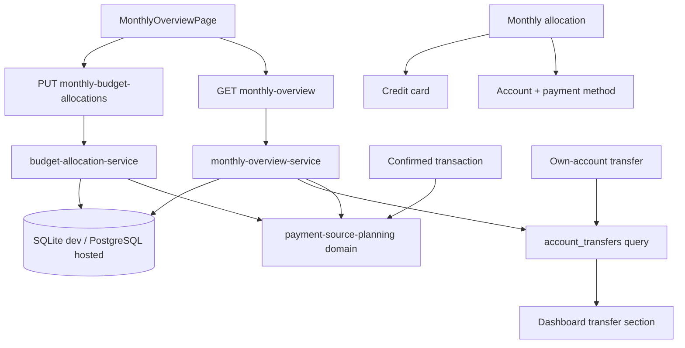

# Design — Planejamento mensal por categoria e meio de pagamento

**Spec:** `.specs/features/payment-source-planning/spec.md`
**Status:** approved
**Criado em:** 2026-07-13
**Última atualização:** 2026-08-14

---

## Visão de arquitetura

O planejamento mensal passa a usar uma única fonte canônica: alocações por subcategoria e meio de
pagamento. Uma alocação aponta para exatamente uma combinação `conta + forma de pagamento` ou para
um cartão de crédito. O total planejado da categoria é sempre a soma das alocações; não existe total
paralelo, linha fictícia ou valor `Não distribuído`.

O realizado continua derivado dos lançamentos confirmados. Despesas em conta são agregadas por
`accountId + paymentMethodId`; compras no crédito são agregadas por `creditCardId` no mês da fatura.
Transferências entre contas são lidas do agregado `account_transfers` e incluídas separadamente na
resposta do dashboard. Suas duas pernas nunca entram nos totais econômicos.



### Regra mental canônica

- **Conta:** mantém saldo.
- **Forma de pagamento:** descreve como uma conta foi usada e não mantém saldo.
- **Meio orçado:** combinação entre conta e forma, ou cartão de crédito.
- **Cartão de crédito:** obrigação própria, realizada no mês da fatura e sem `paymentMethodId`.
- **Total planejado da categoria:** soma das alocações daquele mês e subcategoria.
- **Transferência para terceiro:** despesa comum cuja forma pode ser `Transferência`.
- **Transferência entre contas próprias:** movimento de caixa neutro, identificado por `transferId`.

---

## Análise de reuso

| Componente existente                  | Local                                                          | Como usar                                                      |
| ------------------------------------- | -------------------------------------------------------------- | -------------------------------------------------------------- |
| Associações conta–forma               | `account_payment_methods` e contratos de conta                 | Validar e nomear combinações orçáveis.                         |
| Lançamentos com conta, forma e cartão | `transactions`                                                 | Derivar realizado sem persistir execução duplicada.            |
| Classificação financeira              | `packages/domain/src/financial-classification.ts`              | Excluir transferências e pagamentos de fatura dos gastos.      |
| Planejamento por origem               | `packages/domain/src/payment-source-planning.ts`               | Evoluir a chave de conta para conta + forma.                   |
| Resumo mensal                         | `apps/api/src/application/monthly-overview-service.ts`         | Orquestrar planejamento, realização, cartões e transferências. |
| Agregado de transferência             | `account_transfers` e `transfer-service.ts`                    | Ler fatos realizados sem reconstruí-los pelas duas pernas.     |
| Opções `Conta · Forma`                | `apps/web/src/app/shared/payment-source-options.ts`            | Reusar no editor de alocações.                                 |
| Seletor de mês                        | `apps/web/src/app/shared/MonthSelector.tsx`                    | Manter navegação temporal do painel.                           |
| Componentes mensais                   | `MonthAtGlance`, `MonthlyHealthSummary`, `BudgetCategoryTable` | Evoluir em vez de criar uma página paralela.                   |
| Cliente HTTP e schemas web            | `api-client.ts`, `api-contracts.ts`                            | Validar a resposta ampliada na fronteira do frontend.          |

### Duplicações encontradas

- O formatador BRL está repetido em pelo menos seis componentes; extrair para
  `apps/web/src/app/shared/money.ts` ao tocar esses componentes.
- A montagem de `Conta · Forma` já está centralizada em `payment-source-options.ts`; o editor mensal
  deve reutilizá-la, sem criar outro mapper.
- A exclusão de transferências e pagamentos de fatura já existe em
  `financial-classification.ts`; agregadores novos devem usar esses classificadores.
- `MonthlyOverviewPage` já coordena carregamento, erro e mês selecionado; não criar um segundo estado
  global ou uma segunda rota de página.

### Código substituído

`planned_expenses`, suas rotas, serviço, editor e contratos deixam de ser a fonte do orçamento. A
remoção só ocorre no Execute, após busca de todos os consumidores e substituição dos testes. Como o
protótipo permite reconstrução controlada do banco de desenvolvimento, a baseline de ambos os
dialetos será atualizada sem inferir nomes de despesas como alocações.

As migrations criam `monthly_budget_allocations` e, em uma etapa posterior, removem
`planned_expenses` sem conversão automática. Antes de aplicar a remoção fora de uma base descartável,
é obrigatório criar backup recuperável; rollback operacional significa restaurar esse backup e
executar a versão anterior da aplicação. A migration destrutiva não possui downgrade por inferência.

---

## Componentes de domínio e aplicação

### Planejamento por meio de pagamento

- **Propósito:** validar alocações e calcular planejado, gasto, disponível e acima do planejado por
  combinação e por categoria.
- **Local:** `packages/domain/src/payment-source-planning.ts`.
- **Interface:**
  - `validateMonthlyBudgetAllocations(input) -> MonthlyBudgetAllocation[]`
  - `buildPaymentMethodOverview(input) -> PaymentMethodOverview`
- **Reusa:** classificadores financeiros e schemas de datas/centavos.

Invariantes:

- alocação em conta exige `accountId` e `paymentMethodId`;
- alocação em cartão exige somente `creditCardId`;
- as duas variantes são mutuamente exclusivas;
- a mesma chave aparece no máximo uma vez por mês e subcategoria;
- valores são centavos inteiros positivos;
- combinações arquivadas permanecem legíveis no histórico, mas não recebem novas alocações;
- transferências próprias e pagamentos de fatura nunca realizam alocação;
- estorno e reembolso reduzem o realizado da combinação original sem produzir valor negativo.

### Serviço de alocações mensais

- **Propósito:** substituir atomicamente as alocações de uma subcategoria e copiar planejamento.
- **Local:** `apps/api/src/modules/payment-source-planning/application/service.ts`.
- **Interface:**
  - `replaceAllocations(input) -> MonthlyBudgetAllocation[]`
  - `copyMonth(sourceMonth, targetMonth) -> CopyMonthlyBudgetResult`
- **Dependências:** Drizzle, conexão transacional e domínio puro.

`replaceAllocations` valida todas as combinações antes de apagar ou gravar qualquer linha. Lista
vazia remove o planejamento da subcategoria. `copyMonth` grava novas linhas com novos IDs; conta,
forma ou cartão arquivado é ignorado e devolvido em `skippedAllocations`.

### Composição do dashboard mensal

- **Propósito:** devolver em uma leitura o resumo, as categorias, os meios disponíveis e as
  transferências realizadas no mês.
- **Local:** `apps/api/src/application/monthly-overview-service.ts` e módulo existente.
- **Interface:** `overview(month) -> MonthlyDashboard`.
- **Reusa:** planejamento, consultas de lançamentos, associações e agregado de transferências.

A consulta carrega conjuntos por mês e agrega em memória/domínio sem consulta por categoria. A
seção de transferências usa `account_transfers.event_date` no intervalo do mês, filtra o owner no
servidor e resolve nomes das contas a partir do conjunto já carregado.

### Frontend do painel

- **Propósito:** dar leitura rápida do mês e edição progressiva.
- **Local:** `apps/web/src/app/monthly-control/`.
- **Componentes:**
  - `MonthAtGlance`: planejado, gasto e disponível/acima;
  - `MonthlyAttentionPanel`: categorias acima, próximas do limite e gastos sem plano;
  - `BudgetCategoryTable`: categorias recolhíveis e resumo consolidado;
  - `BudgetPaymentMethodBreakdown`: linhas por meio ao expandir;
  - `BudgetAllocationEditor`: edição de meio + valor sem nome de despesa;
  - `MonthlyTransfersPanel`: transferências realizadas, recolhível e visualmente secundário.

O editor salva por subcategoria. Durante a gravação, preserva o rascunho, desabilita apenas aquela
categoria e atualiza a resposta completa após sucesso. Falha mantém os valores digitados e mostra
erro contextual na própria categoria.

### Planejamento e conciliação de entradas

- **Propósito:** manter o planejamento de receitas separado do orçamento de despesas e conciliá-lo
  com lançamentos realizados.
- **Persistência:** `monthly_income_plans`, com uma linha por
  `owner + mês + subcategoria de receita + conta`.
- **Escrita:** `PUT /monthly-income-plans` substitui atomicamente o conjunto de entradas do mês.
- **Leitura:** `GET /monthly-overview` devolve `incomePlanning.summary`, itens conciliados e opções
  válidas de categoria/conta.

O recebido considera apenas lançamentos `income` confirmados ou conciliados, sem `transferId`,
agrupados pela mesma chave da previsão. Receitas sem plano geram itens com previsto zero. A forma de
recebimento permanece no lançamento para histórico, mas não integra a chave da previsão.

O saldo esperado usa o restante positivo de cada previsão. Ao combinar previsão explícita,
recorrência e lançamento `planned` da mesma conta e subcategoria, considera o maior valor esperado
da chave, evitando dupla contagem.

---

## Modelo de dados

### `monthly_income_plans`

```text
monthly_income_plans
├─ id TEXT PK
├─ owner_id FK users NOT NULL
├─ budget_month TEXT NOT NULL
├─ subcategory_id FK subcategories NOT NULL
├─ account_id FK accounts NOT NULL
├─ amount_cents INTEGER NOT NULL CHECK > 0
├─ created_at
└─ updated_at

UNIQUE (owner_id, budget_month, subcategory_id, account_id)
```

Categorias e contas arquivadas continuam legíveis no histórico, mas não podem receber novas
previsões. A API valida owner, natureza `income`, atividade e centavos antes da transação.

### `monthly_budget_allocations`

Substitui `planned_expenses` como fonte canônica.

```text
monthly_budget_allocations
├─ id TEXT PK
├─ owner_id FK users NOT NULL
├─ budget_month TEXT NOT NULL
├─ subcategory_id FK subcategories NOT NULL
├─ account_id FK accounts NULLABLE
├─ payment_method_id FK payment_methods NULLABLE
├─ credit_card_id FK credit_cards NULLABLE
├─ amount_cents INTEGER NOT NULL CHECK > 0
├─ created_at
└─ updated_at

CHECK (
  (account_id IS NOT NULL AND payment_method_id IS NOT NULL AND credit_card_id IS NULL)
  OR
  (account_id IS NULL AND payment_method_id IS NULL AND credit_card_id IS NOT NULL)
)

UNIQUE (owner_id, budget_month, subcategory_id, account_id, payment_method_id)
UNIQUE (owner_id, budget_month, subcategory_id, credit_card_id)
INDEX  (owner_id, budget_month)
INDEX  (account_id, payment_method_id)
INDEX  (credit_card_id)
```

As duas constraints únicas com campos nulos devem ser implementadas de forma equivalente em SQLite
e PostgreSQL e verificadas nos dois dialetos. A API continua validando duplicidade antes do banco.

Não haverá tabela `budgets`: o total planejado é derivado com `SUM(amount_cents)`. Não haverá FK da
alocação para `account_payment_methods`, pois conta e forma precisam permanecer identificáveis no
histórico mesmo após arquivamento; a associação ativa é validada na aplicação ao gravar.

### Transferências

Nenhuma coluna nova é necessária. `account_transfers` já contém owner, origem, destino, valor, data,
descrição e status. As pernas em `transactions` permanecem necessárias para o caixa, mas o dashboard
lista o agregado e não soma suas pernas como renda ou gasto.

---

## Contratos HTTP

Schemas Zod compartilhados validam entrada e resposta.

### Substituir alocações de uma categoria

`PUT /monthly-budget-allocations`

```ts
const monthlyBudgetAllocationInputSchema = z.discriminatedUnion("kind", [
  z.object({
    kind: z.literal("account_method"),
    accountId: entityIdSchema,
    paymentMethodId: entityIdSchema,
    amountCents: positiveCentsSchema
  }),
  z.object({
    kind: z.literal("credit_card"),
    creditCardId: entityIdSchema,
    amountCents: positiveCentsSchema
  })
]);

const replaceMonthlyBudgetAllocationsSchema = z.object({
  budgetMonth: yearMonthSchema,
  subcategoryId: entityIdSchema,
  allocations: z.array(monthlyBudgetAllocationInputSchema)
});
```

O payload substitui o conjunto completo da subcategoria em uma transação. Resposta `200` devolve as
alocações persistidas; lista vazia é válida. Combinação repetida ou inativa retorna `409`; payload
malformado retorna `400`.

### Copiar mês

`POST /monthly-budget-allocations/copy`

Recebe `sourceMonth` e `targetMonth`. O destino precisa estar vazio; se já possuir alocações, retorna
`409` sem alteração. A resposta informa quantidade copiada e combinações arquivadas ignoradas.

### Dashboard mensal

`GET /monthly-overview?month=YYYY-MM`

```text
summary
├─ plannedCents
├─ spentCents
├─ availableCents
└─ abovePlannedCents

items[]
├─ subcategoryId / categoryId / names
├─ plannedCents / spentCents / availableCents / abovePlannedCents
├─ usagePercent: number | null
├─ attention: over | near_limit | unplanned | on_track | unused
└─ paymentMethods[]
   ├─ kind: account_method | credit_card
   ├─ accountId? / paymentMethodId? / creditCardId?
   ├─ label
   ├─ plannedCents / spentCents / availableCents / abovePlannedCents
   └─ isUnplanned

availablePaymentMethods[]
├─ kind
├─ IDs da variante
└─ label

transfers[]
├─ id
├─ eventDate
├─ description
├─ amountCents
├─ sourceAccount: { id, name }
└─ destinationAccount: { id, name }
```

`usagePercent` é `null` quando planejado é zero. O backend devolve fatos e uma classificação
determinística; a UI não recalcula valores financeiros. Transferências não participam de `summary`,
`items` ou `attention`.

---

## UX do painel

Ordem visual:

1. título e seletor do mês;
2. `MonthAtGlance` com três indicadores;
3. área de atenção apenas quando houver exceções;
4. categorias, ordenadas por gravidade e depois pela ordem cadastrada;
5. transferências realizadas em painel recolhível;
6. resumo secundário por meio, se ainda trouxer informação útil após o novo detalhamento.

Estados:

- **Acima do planejado:** texto e valor em destaque crítico.
- **Próximo do limite:** aviso; o limiar permanece decisão de produto pendente.
- **Gasto não planejado:** planejado zero, gasto positivo e valor integral acima.
- **Dentro do planejado:** mostra valor disponível.
- **Sem uso:** mantém o planejado integralmente disponível.
- **Sem planejamento no mês:** oferece `Começar do zero` e `Copiar outro mês`.
- **Sem transferências:** estado vazio compacto dentro do painel recolhível.

Desktop usa linha compacta por categoria; telas estreitas empilham planejado, gasto e situação. O
detalhamento é progressivo e os estados têm texto, valor e semântica acessível, nunca apenas cor.

---

## Estratégia de erro

Segue `ana-standards/references/error-handling.md`: validar cedo, preservar causa e nunca retornar
estado parcial ou valor vazio como se fosse sucesso.

| Cenário                                          | Tratamento                                                        | Impacto para a UI                                                              |
| ------------------------------------------------ | ----------------------------------------------------------------- | ------------------------------------------------------------------------------ |
| Mês ou payload inválido                          | Zod na borda; `400`                                               | Mensagem contextual sem enviar ao domínio.                                     |
| Conta, forma, cartão ou subcategoria inexistente | Validar owner e existência; `404`                                 | Rascunho preservado; solicitar correção.                                       |
| Combinação arquivada ou forma não associada      | Rejeitar antes da transação; `409`                                | Recarregar opções e manter valores editados.                                   |
| Combinação duplicada                             | Domínio e constraint; `409`                                       | Destacar linhas conflitantes.                                                  |
| Falha ao substituir várias alocações             | Transação atômica; log estruturado e erro com causa               | Nenhuma linha muda; mostrar falha reproduzível.                                |
| Destino da cópia já planejado                    | Não sobrescrever; `409`                                           | Pedir escolha explícita em evolução futura.                                    |
| Transferência com agregado inconsistente         | Falhar a leitura e registrar ID técnico; não inferir pelas pernas | Dashboard mostra erro geral com opção de tentar novamente.                     |
| Banco indisponível                               | Propagar `5xx` com correlação, sem valores financeiros em logs    | Manter última tela apenas como visualmente desatualizada, sem afirmar sucesso. |
| Falha de carregamento no navegador               | `apiClient` preserva erro; página mostra retry                    | Não renderizar zeros falsos.                                                   |

Não há integração externa nova, portanto retry/backoff não se aplica. Chamadas HTTP do navegador
seguem o timeout central do `apiClient`; mutações não são repetidas automaticamente.

---

## Decisões técnicas

| Decisão                     | Escolha                                   | Por quê                                                 |
| --------------------------- | ----------------------------------------- | ------------------------------------------------------- |
| Fonte canônica              | `monthly_budget_allocations`              | Representa diretamente o modelo mental aprovado.        |
| Total da categoria          | Soma derivada                             | Evita divergência entre total e distribuição.           |
| Chave de conta              | `accountId + paymentMethodId`             | Permite granularidade real dentro da mesma conta.       |
| Cartão                      | Variante exclusiva por `creditCardId`     | Preserva competência da fatura e evita forma sintética. |
| Realizado                   | Derivado de `transactions`                | Não duplica estado nem exige conciliação manual.        |
| Transferências no dashboard | Ler `account_transfers`                   | Usa o agregado íntegro e evita contar duas pernas.      |
| Endpoint do dashboard       | Ampliar `GET /monthly-overview`           | Uma tela, um snapshot coerente e sem waterfall.         |
| Edição                      | Substituição atômica por subcategoria     | Interface simples e estado consistente.                 |
| Compatibilidade             | Remover `planned_expenses` no mesmo ciclo | A unidade anterior foi explicitamente substituída.      |
| Dialetos                    | Mesmas invariantes em SQLite e PostgreSQL | Desenvolvimento e hospedagem não podem divergir.        |

---

## Verificação prevista

- domínio: alocação por conta+forma, cartão, duplicidade, estorno e gasto não planejado;
- banco: constraints e migrations equivalentes em SQLite e PostgreSQL;
- API: substituição atômica, cópia, owner scope, combinações arquivadas e transferências no mês;
- frontend: ordenação de atenção, estados vazios, edição com rascunho preservado e acessibilidade;
- regressão: transferência e pagamento de fatura continuam fora do gasto; parcela permanece no mês
  da fatura; projeção de caixa continua por conta;
- gate: `pnpm check` com Node e pnpm previstos em `.specs/codebase/STACK.md`.

---

## Decisões aprovadas para execução

1. `Próximo do limite` começa quando o gasto atinge 80% do planejado.
2. O dashboard lista somente transferências realizadas nesta entrega.

Essas decisões não alteram o modelo de dados e foram aprovadas com a entrada na fase Tasks.

---

_Próxima fase após aprovação: `tasks.md`. A feature é grande, multi-camada e exige migração, portanto
a fase Tasks não deve ser pulada._
