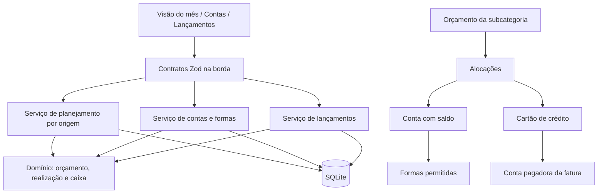

# Design — Planejamento por conta e forma de pagamento

## Revisão de design — linhas de despesas planejadas

Esta seção substitui a edição direta do total descrita abaixo. O restante do design — contas,
formas associadas, cartões, realização e caixa — permanece válido.

### Modelo revisado

```text
Categoria/subcategoria mensal
└── planned_expenses (0..N)
    ├── name
    ├── amount_cents
    ├── account_id XOR credit_card_id
    ├── recurrence_rule_id opcional
    └── sort_order

Total planejado da categoria = SUM(planned_expenses.amount_cents)
Realizado da categoria = SUM(transactions realizadas da categoria)
```

`budgets` deixa de ser editado diretamente. Durante a transição pode permanecer como projeção
materializada compatível, mas a fonte canônica passa a ser `planned_expenses`; o total e a
distribuição por origem são derivados das linhas. `budget_allocations` torna-se substituível e deve
ser removida quando os consumidores usarem as linhas diretamente.

### Regras

- Cada linha pertence a um mês e subcategoria e possui exatamente uma origem: conta XOR cartão.
- Nomes podem se repetir; são descrições de planejamento, não categorias adicionais.
- Lançamentos continuam ligados somente à categoria/subcategoria e origem realizada.
- Não existe conciliação obrigatória lançamento ↔ linha planejada.
- Cópia mensal duplica as linhas com novos IDs e preserva nome, valor, ordem e origem ativa.
- Recorrência sugere a linha no planejamento futuro; nunca cria gasto realizado antecipadamente.
- Totais por categoria, origem e caixa são derivados e não podem divergir da soma das linhas.

### UX revisada

A visão mensal apresenta categorias expansíveis. Dentro de cada categoria, a usuária adiciona e
edita despesas em uma lista curta, com nome, valor e `Conta` ou `Cartão`. O cabeçalho da categoria
mostra total planejado, realizado, disponível e valor acima do planejado. Não há campo principal
para digitar o total agregado nem obrigação de distribuir um valor previamente informado.

O fluxo prioritário é teclado-first: `Adicionar despesa`, nome, valor, origem, Enter para salvar e
manter a categoria aberta. Copiar o mês preserva todas as linhas. Erros ficam na própria linha sem
fechar ou limpar o rascunho.

**Spec:** `.specs/features/payment-source-planning/spec.md`
**Status:** approved
**Criado em:** 2026-07-13

---

## Visão de arquitetura

O orçamento continua tendo um total canônico por mês e subcategoria. Uma tabela filha distribui
esse total entre contas e cartões de crédito; o valor não distribuído é derivado, nunca persistido
como uma origem fictícia. A realização continua derivada dos lançamentos confirmados, usando
`accountId` para consumo imediato e `creditCardId` para consumo em fatura.

Formas de pagamento são uma taxonomia global e sem saldo. Uma associação conta–forma define quais
combinações podem ser usadas e qual delas é sugerida por padrão. O cartão de crédito permanece fora
dessa taxonomia operacional: ele é uma obrigação com fatura e conta pagadora própria.



### Regra mental canônica

- **Conta:** mantém saldo; inclui contas bancárias, dinheiro e benefícios pré-pagos.
- **Forma de pagamento:** descreve como uma conta foi movimentada; não mantém saldo.
- **Cartão de crédito:** acumula obrigação em fatura; não é conta nem forma associável.
- **Orçamento total:** quanto pode ser consumido na subcategoria naquele mês.
- **Alocação:** parte do orçamento que se pretende pagar por uma conta ou cartão.
- **Não distribuído:** `max(orçamento total - soma das alocações, 0)`.
- **Realização por origem:** derivada da conta ou cartão do lançamento confirmado.
- **Caixa:** saldo real da conta, reduzido imediatamente por compras em conta e posteriormente pelo pagamento da fatura.

---

## Análise de reuso

| Componente existente | Local | Como usar |
| --- | --- | --- |
| Tipos de conta, incluindo `benefit` | `packages/domain/src/accounts.ts` | Manter `Flash Alimentação` e `Flash Conveniência` como contas do tipo benefício. |
| Contas e saldos | `packages/database/src/schema.ts`, `apps/api/src/modules/accounts.ts` | Estender a resposta com associações; preservar cálculo de saldo após centralizá-lo. |
| Taxonomia de formas | `packages/database/src/seed-data.ts`, tabela `payment_methods` | Manter tipos predefinidos e remover crédito como forma operacional. |
| Conta pagadora do cartão | `credit_cards.payment_account_id` | Reusar para atribuir faturas e planejamento futuro do cartão ao caixa correto. |
| Origem realizada | `transactions.account_id`, `payment_method_id`, `credit_card_id` | Derivar realização sem criar tabela duplicada de execução. |
| Orçamento canônico | tabela `budgets` | Preservar total único por mês e subcategoria. |
| Cálculo mensal puro | `packages/domain/src/monthly-overview.ts` | Estender para totais e detalhes por origem. |
| Posição de caixa | `buildCashPosition` e `AccountsCashView` | Acrescentar orçamento restante e separar benefícios de caixa livre. |
| Edição inline | `InlineBudgetAmount.tsx` | Continuar editando o total antes de abrir a distribuição. |
| Seleção conta/cartão | `TransactionsPage.tsx` | Reusar a separação existente entre conta e cartão; filtrar formas pela conta. |
| Cliente e schemas web | `shared/api-client.ts`, `shared/api-contracts.ts` | Validar as respostas ampliadas e evitar novos tipos manuais. |

### Duplicações a tratar quando tocadas

- Centralizar o cálculo de saldo hoje repetido em lista de contas, conta individual e domínio mensal.
- Extrair schemas compartilhados de `Account`, `PaymentMethod` e `CreditCard`, hoje redeclarados nas páginas.
- Extrair a montagem de opções `Conta · Forma`, repetida entre contas, lançamentos e importação.
- Usar o formatador monetário compartilhado em vez de criar novas instâncias locais.
- Fazer `AccountsPage` usar `apiClient` e contratos Zod antes de ampliar seu payload.
- Remover o identificador sintético `pm-credit-card` dos filtros e relatórios; compras no crédito são identificadas por `creditCardId`.

Essas extrações fazem parte da feature apenas nos pontos tocados. Não haverá reorganização ampla dos
módulos financeiros existentes nesta entrega.

### Varredura e remoção de código morto

A limpeza é uma entrega rastreável, não uma remoção por impressão visual. Antes de apagar, a
implementação deve reunir evidência por:

1. imports estáticos e exports públicos com `rg`;
2. registros dinâmicos de rotas, componentes e scripts;
3. referências em testes, seeds, migrations e documentação canônica;
4. typecheck e build antes e depois da remoção;
5. testes dos fluxos substitutos que comprovam o contrato canônico.

O inventário inicial obrigatório inclui:

- `pm-credit-card` e todos os filtros/agrupamentos que o sintetizam;
- `accounts.default_payment_method_id` e fallbacks que leem somente uma forma;
- payloads e schemas do orçamento sem `allocations`;
- contratos frontend manuais substituídos por schemas compartilhados;
- componentes, helpers e testes ligados a fluxos financeiros já removidos;
- categorias ou subcategorias internas usadas para transferência/pagamento de fatura;
- migrations e snapshots anteriores à nova baseline;
- seeds que gravem cartão com `paymentMethodId` ou criem origens inexistentes.

Teste não é considerado morto apenas porque cobre contrato antigo. Primeiro se confirma que o
comportamento foi removido; depois o teste é substituído pela cobertura equivalente do contrato novo.

### Pontos de integração

| Sistema | Como a feature conecta |
| --- | --- |
| Lançamentos manuais | Valida conta + forma associada ou cartão, de maneira mutuamente exclusiva. |
| Importação CSV | Exige uma combinação válida antes da confirmação; não inventa conta ou forma. |
| Recorrências | Conta recorrente usa forma associada; cartão continua sem `paymentMethodId`. |
| Faturas | Compras realizam alocação do cartão; pagamento afeta somente o caixa da conta pagadora. |
| Transferências | Continuam com duas contas e sem forma de consumo ou alocação realizada. |
| Relatórios | Usam conta/cartão real, eliminando o crédito sintético da taxonomia de formas. |

---

## Componentes

### Domínio de planejamento por origem

- **Propósito:** validar distribuições e calcular planejado, realizado, disponível e divergência por origem.
- **Local:** `packages/domain/src/payment-source-planning.ts`.
- **Interface:**
  - `validateBudgetDistribution(input) -> BudgetDistribution`
  - `buildPaymentSourceOverview(input) -> PaymentSourceOverview`
  - `buildAccountCashProjection(input) -> AccountCashProjection[]`
- **Dependências:** datas, centavos, classificação financeira e regras de fatura existentes.
- **Reusa:** `buildMonthlyOverview`; seus totais permanecem compatíveis e passam a ser compostos pelo novo cálculo.

Invariantes:

- cada alocação possui exatamente uma origem: conta XOR cartão;
- valores são inteiros positivos;
- uma origem aparece no máximo uma vez por orçamento;
- soma das alocações não supera o total;
- conta/cartão arquivado não recebe nova alocação;
- realizado nunca é persistido na alocação;
- transferências e pagamentos de fatura não realizam orçamento.

### Serviço de planejamento mensal

- **Propósito:** carregar origens, persistir orçamento e alocações atomicamente e compor a visão mensal.
- **Local:** `apps/api/src/modules/payment-source-planning/application/service.ts`.
- **Interface:**
  - `getOverview(month) -> MonthlyOverview`
  - `replaceBudget(input) -> BudgetWithAllocations | null`
  - `copyMonth(sourceMonth, targetMonth) -> CopyResult`
- **Dependências:** Drizzle, domínio puro e consultas agregadas.
- **Reusa:** rota mensal atual e contratos compartilhados.

`replaceBudget` substitui total e distribuição em uma única transação SQLite. Valor total zero remove
orçamento e alocações. Falha em qualquer linha reverte a operação inteira.

### Associações de conta e forma

- **Propósito:** manter formas ativas e uma sugestão padrão por conta.
- **Local:** `apps/api/src/modules/accounts/application/payment-method-associations.ts`.
- **Interface:**
  - `replaceAccountPaymentMethods(accountId, associations) -> Association[]`
  - `assertActiveAccountPaymentMethod(accountId, paymentMethodId) -> void`
- **Dependências:** contas e formas globais.
- **Reusa:** criação/edição e arquivamento atuais de contas.

Criação e edição de conta persistem conta e associações na mesma transação. O padrão é uma propriedade
da associação, não uma FK direta em `accounts`.

### Validação de lançamentos

- **Propósito:** impedir combinações de conta, forma e cartão que não correspondam ao modelo.
- **Local:** serviço de lançamentos existente, usando o validador de associações.
- **Interface:** `validateTransactionPaymentSource(input) -> ValidatedPaymentSource`.
- **Reusa:** normalização atual que zera conta e forma para compras no cartão.

Regras:

- compra em conta exige `accountId` e `paymentMethodId` associados e ativos;
- compra no cartão exige `creditCardId` e mantém conta/forma nulas;
- entradas em conta e movimentos estruturais preservam contratos próprios e não são forçados a usar forma de consumo;
- importação não confirmada pode ficar incompleta; confirmação usa as mesmas regras da criação manual.

### Frontend de contas

- **Propósito:** cadastrar conta e formas permitidas sem introduzir “instrumento” ou “carteira”.
- **Local:** `apps/web/src/app/accounts/`.
- **Reusa:** modal atual de conta e `accountTypes`.

Comportamento:

- tipo `checking` sugere Pix e débito;
- tipo `benefit` sugere cartão pré-pago;
- sugestões são editáveis antes de salvar;
- uma forma pode ser marcada como padrão;
- Flash Alimentação e Flash Conveniência são cadastradas como contas separadas;
- a tabela mostra formas ativas, não apenas uma forma principal.

### Frontend de planejamento

- **Propósito:** manter a leitura simples dos totais e revelar a distribuição sob demanda.
- **Local:** `apps/web/src/app/monthly-control/`.
- **Componentes propostos:**
  - `PaymentSourceSummary.tsx`: planejado e realizado por conta/cartão;
  - `BudgetSourceBreakdown.tsx`: resumo compacto dentro da linha da categoria;
  - `BudgetAllocationDrawer.tsx`: edição da distribuição;
  - `UndistributedBudgetAlert.tsx`: total não distribuído e estado incompleto.
- **Reusa:** `BudgetCategoryTable`, `InlineBudgetAmount` e seletor mensal.

A tabela principal mantém `Planejado`, `Gasto`, `Disponível` e situação. Cada linha acrescenta um
resumo `Pago por`; abrir a linha mostra as alocações. Não serão criadas colunas dinâmicas para cada
conta, pois múltiplas contas tornariam a tabela horizontalmente instável.

### Frontend de lançamentos e importação

- **Propósito:** mostrar somente combinações válidas e autoescolher quando não houver ambiguidade.
- **Local:** `TransactionsPage.tsx`, `import-preview.ts` e componentes compartilhados extraídos.
- **Reusa:** seletor `Conta` versus `Cartão de crédito` existente.

Ao escolher conta, o campo de forma mostra apenas associações ativas. Uma única opção é selecionada
automaticamente; múltiplas opções respeitam a padrão, mas continuam editáveis.

---

## Modelos de dados

### Associações conta–forma

```text
account_payment_methods
├─ id
├─ account_id FK accounts NOT NULL
├─ payment_method_id FK payment_methods NOT NULL
├─ is_default BOOLEAN NOT NULL DEFAULT false
├─ is_active BOOLEAN NOT NULL DEFAULT true
├─ archived_at NULLABLE
├─ created_at
└─ updated_at

UNIQUE (account_id, payment_method_id)
INDEX  (account_id, is_active)
```

Somente uma associação ativa pode ser padrão por conta; a aplicação valida essa invariável dentro
da mesma transação que substitui as associações. Linhas são arquivadas, nunca apagadas quando já
existirem no histórico lógico.

`accounts.default_payment_method_id` é removido. O padrão passa a ser lido de
`account_payment_methods.is_default`.

### Orçamento e alocações

```text
budgets
├─ id
├─ budget_month
├─ subcategory_id
├─ amount_cents
├─ created_at
└─ updated_at

UNIQUE (budget_month, subcategory_id)
```

```text
budget_allocations
├─ id
├─ budget_id FK budgets NOT NULL
├─ account_id FK accounts NULLABLE
├─ credit_card_id FK credit_cards NULLABLE
├─ amount_cents > 0
├─ created_at
└─ updated_at

CHECK exatamente um entre account_id e credit_card_id
UNIQUE (budget_id, account_id)
UNIQUE (budget_id, credit_card_id)
INDEX  (account_id)
INDEX  (credit_card_id)
```

Não existe linha `Não distribuído`. O valor é sempre derivado:

```text
undistributed_cents = budget.amount_cents - SUM(budget_allocations.amount_cents)
```

A aplicação rejeita resultado negativo antes de persistir. Alocações históricas podem apontar para
origens arquivadas; novas gravações não podem.

### Lançamentos

As colunas existentes são suficientes:

```text
transactions
├─ account_id
├─ payment_method_id
├─ credit_card_id
├─ credit_card_bill_id
├─ subcategory_id
├─ budget_month
└─ status
```

Não será criada FK entre transação e `account_payment_methods`. A associação preservada é validada
pela dupla `accountId + paymentMethodId`, enquanto as duas FKs existentes mantêm a identificação
histórica mesmo após arquivamento.

### Benefício recebido

Não haverá novo tipo de transação. Uma entrada externa confirmada em conta do tipo `benefit` é
classificada na leitura como `benefitIncome`; transferência própria continua identificada por
`transferId` e permanece neutra.

Essa derivação evita gravar `incomeKind` redundante, mas só é válida enquanto toda entrada externa em
conta `benefit` representar benefício restrito. Caso o produto precise distinguir outros créditos
externos nessa mesma conta, será necessário novo requisito explícito.

---

## Contratos HTTP

Todos os contratos ficam em schemas Zod compartilhados no domínio e são validados no início da rota.

### Conta

```ts
const accountPaymentMethodInputSchema = z.object({
  paymentMethodId: entityIdSchema,
  isDefault: z.boolean().default(false),
});

const accountInputSchema = z.object({
  name: z.string().trim().min(1),
  type: accountTypeSchema,
  institution: z.string().trim().nullish(),
  initialBalanceCents: z.number().int(),
  isPrimary: z.boolean().default(false),
  paymentMethods: z.array(accountPaymentMethodInputSchema),
});
```

`GET /accounts` devolve cada conta com `paymentMethods[]`, contendo ID, nome, tipo, padrão e estado.
POST/PUT substituem as associações junto com a conta.

### Orçamento distribuído

```ts
const budgetAllocationInputSchema = z.object({
  accountId: entityIdSchema.nullish(),
  creditCardId: entityIdSchema.nullish(),
  amountCents: positiveCentsSchema,
}).superRefine(exactlyOnePaymentSource);

const distributedBudgetInputSchema = z.object({
  budgetMonth: yearMonthSchema,
  subcategoryId: entityIdSchema,
  amountCents: nonNegativeCentsSchema,
  allocations: z.array(budgetAllocationInputSchema),
});
```

`PUT /monthly-budgets` passa a substituir atomicamente o orçamento e sua distribuição. A soma pode
ser menor ou igual ao total; maior é inválida. Valor total zero exige lista vazia e remove o conjunto.

`POST /monthly-budgets/copy` recebe `sourceMonth` e `targetMonth`. Origens arquivadas não são copiadas;
seus valores permanecem no total como não distribuídos e são informados em `skippedAllocations`.

### Visão mensal

`GET /monthly-overview` preserva os campos atuais e acrescenta:

```text
item
├─ plannedCents
├─ spentCents
├─ availableCents
├─ abovePlannedCents
├─ undistributedCents
├─ planningStatus: complete | incomplete
└─ sources[]
   ├─ kind: account | credit_card
   ├─ id
   ├─ name
   ├─ plannedCents
   ├─ spentCents
   ├─ availableCents
   └─ abovePlannedCents

summary
├─ campos atuais
├─ undistributedCents
├─ freeIncomeCents
└─ benefitIncomeCents

sourceSummary[]
├─ kind
├─ id
├─ name
├─ plannedCents
├─ spentCents
└─ differenceCents
```

Compras realizadas em origem não planejada criam uma linha derivada com `plannedCents = 0` e valor
`abovePlannedCents`, sem alterar automaticamente o plano.

### Posição de caixa

`GET /cash-position` acrescenta por conta:

```text
directPlanRemainingCents
expectedCardPurchasesCents
outstandingBillsCents
expectedIncomeCents
benefitIncomeCents
expectedBalanceCents
atRisk
```

O cálculo por conta é:

```text
saldo atual
+ entradas futuras da conta
- consumo direto restante
- faturas ainda não pagas
- compras planejadas no cartão ainda não faturadas
= saldo previsto
```

Para não duplicar recorrências, a saída restante de cada conta/cartão e subcategoria é o maior entre:

```text
planejado na origem - realizado na origem
previsões recorrentes ainda não realizadas nessa origem
```

Faturas já abertas entram em `outstandingBillsCents`; somente a parte planejada do cartão ainda não
presente na fatura entra em `expectedCardPurchasesCents`. Pagamento de fatura nunca entra como consumo.

---

## Reconstrução destrutiva, baseline e dados de desenvolvimento

A sponsor autorizou migração destrutiva porque o produto ainda não está em produção. A implementação
revisa o schema completo, consolida as migrations Drizzle em uma baseline nova, recria a base local
de desenvolvimento explicitamente selecionada e atualiza os seeds. Não haverá heurística para
distribuir orçamentos antigos nem para inferir associações a partir do histórico.

### Revisão do schema

Antes de gerar a baseline, revisar todas as tabelas e classificar cada coluna, índice e constraint
como `mantém`, `altera` ou `remove`. A baseline deve conter apenas o modelo canônico, incluindo:

- contas sem `default_payment_method_id`;
- associações em `account_payment_methods`;
- orçamento pai e `budget_allocations`;
- cartões e faturas sem forma sintética de crédito;
- transferências e pagamentos estruturais sem categoria interna;
- índices usados pelas consultas mensais e de saldo;
- checks de centavos positivos, XOR de origem e unicidades definidas no Design.

### Consolidação das migrations

- remover migrations e snapshots anteriores do protótipo somente na branch da feature;
- gerar uma única baseline Drizzle a partir do schema revisado;
- executar a baseline tanto em arquivo vazio quanto após apagar uma base temporária existente;
- não prometer compatibilidade com bancos anteriores;
- documentar que a restauração de backup de schema antigo não é suportada após a consolidação.

### Guardas do comando destrutivo

O reset exige simultaneamente:

- `NODE_ENV=development` ou marcador explícito de UAT;
- `DATABASE_PATH` informado explicitamente;
- caminho resolvido dentro de diretório temporário/UAT ou diretório de dados de desenvolvimento aprovado;
- confirmação por flag dedicada, não inferida por execução de `db:migrate` comum;
- impressão do caminho antes de qualquer exclusão.

Ausência ou divergência em qualquer guarda encerra o comando antes de abrir ou apagar o arquivo.
Arquivos de backup e diretórios de backup nunca são enumerados pelo reset.

O seed padrão deve:

- remover `pm-credit-card` da taxonomia de formas;
- manter Pix, débito, pré-pago, dinheiro, boleto, débito automático e transferência;
- associar formas compatíveis às contas fictícias;
- criar Flash Alimentação e Flash Conveniência como contas `benefit` independentes;
- distribuir o orçamento de demonstração entre contas e cartão;
- incluir benefício recebido, consumo pré-pago, consumo bancário e compra no crédito.

Antes de recriar qualquer base, o comando deve imprimir o caminho resolvido e recusar caminhos fora
do ambiente de desenvolvimento explicitamente configurado. A base pessoal não participa do UAT.

### Verificações após reconstrução

- `PRAGMA integrity_check` retorna `ok`;
- `PRAGMA foreign_key_check` não retorna linhas;
- todas as migrations da baseline constam como aplicadas;
- seed padrão e seed de demonstração são idempotentes;
- não existem referências órfãs entre orçamento/alocação, conta/forma, cartão/fatura e transações;
- smoke da API lê contas, formas, planejamento, caixa, cartões e lançamentos;
- uma segunda execução do reset produz o mesmo schema e cenário esperado.

---

## Estratégia de erro

Segue `ana-standards/references/error-handling.md`: falha cedo, nunca engole e preserva o estado
anterior. Erros de domínio recebem status 4xx; falhas inesperadas são registradas pelo handler global
com stack e mensagem segura para a interface.

| Cenário de falha | Tratamento | Impacto para quem chama |
| --- | --- | --- |
| Alocações superam o orçamento | Zod/domínio rejeita antes da transação | 400 e editor preserva último estado válido. |
| Conta/cartão inexistente ou arquivado | Serviço valida referências ativas | 409 com origem identificada. |
| Conta e cartão juntos ou ambos ausentes | Refinamento Zod rejeita | 400 no campo da origem. |
| Forma não associada à conta | Validador de associação rejeita | 409; formulário recarrega opções sem limpar os demais campos. |
| Duas formas padrão na mesma conta | Serviço rejeita substituição atômica | 400 e configuração anterior permanece. |
| Associação arquivada em recorrência | Confirmação revalida referências | 409; nenhuma ocorrência é criada. |
| Origem arquivada ao copiar mês | Não copia a alocação e retorna aviso estruturado | 200 com `skippedAllocations`; total fica não distribuído. |
| Falha no meio da substituição | Transação SQLite reverte orçamento e alocações | 500 registrado; UI mantém dados carregados. |
| Resposta HTTP fora do schema | `apiClient` lança erro validado | Alerta visível; nenhum fallback silencioso. |
| Falha ao recriar base de desenvolvimento | Comando encerra sem continuar seed | Erro com caminho e causa; não toca outra base. |
| Código candidato ainda possui import/registro | Remoção é bloqueada até esclarecer a referência | Item permanece no inventário, sem exclusão especulativa. |
| Baseline deixa FK órfã ou integridade inválida | Gate falha e a reconstrução não é considerada concluída | Saída não-zero com resultado dos pragmas. |
| Reset aponta para backup ou caminho não aprovado | Guardas rejeitam antes de abrir o arquivo | Erro explícito; nenhum arquivo é alterado. |

Não há I/O externo novo; timeout e retry não se aplicam a esta feature.

---

## Decisões técnicas

| Decisão | Escolha | Por quê |
| --- | --- | --- |
| Total versus distribuição | `budgets` permanece pai; `budget_allocations` é filha | Preserva total canônico e evita linhas ambíguas com `NULL`. |
| Valor não distribuído | Derivado, não persistido | Impede divergência entre total e uma origem fictícia. |
| Realização | Derivada de `transactions` | Conta/cartão já identificam o fato; persistir execução duplicaria estado. |
| Planejamento por forma exata | Não | Pix/débito não mudam a origem do saldo; a forma é preservada na realização. |
| Associações | Tabela N:N com padrão por conta | Uma forma pode existir em várias contas e cada conta pode ter várias formas. |
| Cartão físico Flash | Não modelado | Os fatos financeiros relevantes são os dois saldos Flash e a forma pré-paga. |
| Crédito na taxonomia de formas | Remover `pm-credit-card` | Crédito é identificado por `creditCardId` e possui fatura própria. |
| Benefício recebido | Derivar por conta `benefit` | Evita novo campo enquanto a semântica confirmada for única. |
| UX da distribuição | Resumo na linha + drawer | Mantém totais legíveis e suporta várias contas sem colunas dinâmicas. |
| Migração | Destrutiva em desenvolvimento | Autorizada pela sponsor; evita inferir associações e distribuições inexistentes. |
| Histórico de migrations | Consolidar em uma baseline | O protótipo não está em produção e não precisa carregar transições descartadas. |
| Código morto | Remover somente com evidência de inacessibilidade | Evita apagar registros dinâmicos ou cobertura ainda necessária. |
| Backups | Nunca incluídos no reset | Destrutividade do banco de desenvolvimento não autoriza apagar cópias de segurança. |

---

## Verificação do Design contra a spec

| Requisito | Cobertura no Design |
| --- | --- |
| ACC-01 | Conta `benefit`, saldos independentes, arquivamento e seed Flash. |
| PMT-01 | `account_payment_methods`, validação e UX filtrada. |
| PLAN-01 | `budget_allocations`, contrato atômico e editor progressivo. |
| EXEC-01 | Realização derivada e visão por origem. |
| CASH-02 | Fórmula de caixa sem duplicar recorrência ou fatura. |
| UX-02 | Sugestões por tipo, autoescolha e linguagem simplificada. |
| CLEAN-01 | Inventário de legado, baseline consolidada, reset guardado e gates de integridade. |

**Cobertura:** 7 requisitos · 7 cobertos · 0 sem design.

---

_Próxima fase: `tasks.md`. A feature exige quebra atômica por domínio, banco, API, migração e UI._
