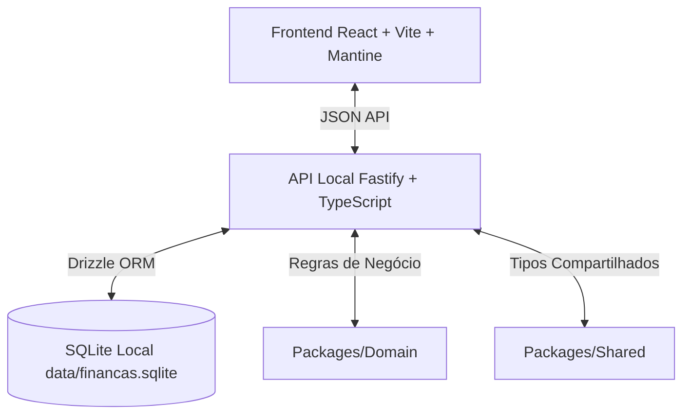
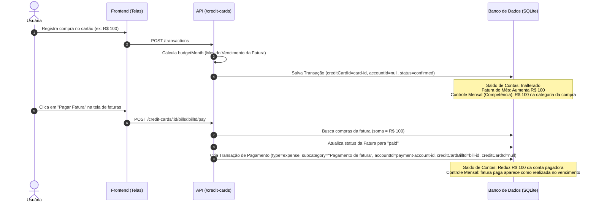
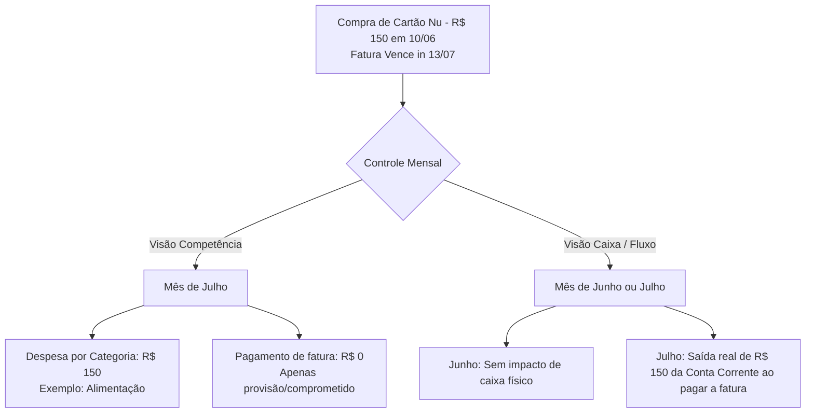
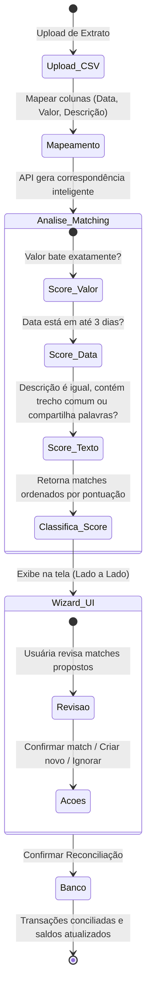
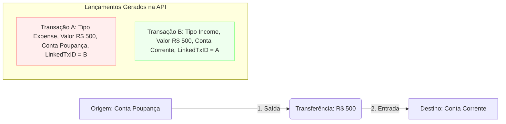

# Guia de Features e Fluxos Financeiros

Este documento serve como guia detalhado sobre o funcionamento, regras de negócio aplicadas, e fluxos de dados do aplicativo **Finanças Pessoais**. Ele explica como cada módulo interage com o outro e apresenta diagramas visuais e tabelas de fluxo para facilitar o entendimento de processos complexos.

---

## 1. Visão Geral da Arquitetura

O sistema é construído como um monorepo local voltado para execução off-line (`localhost`), preparado para empacotamento futuro via Electron.



*   **Banco de Dados**: SQLite local, armazenado em `data/financas.sqlite`.
*   **Controle Mensal**: A tela central de competência e caixa que dita o comportamento econômico do aplicativo.

---

## 2. Guia de Features por Módulo

### 2.1 Controle Mensal (`/controle-mensal`)
É o coração financeiro do app. Ele permite visualizar o andamento financeiro do mês através de duas abordagens:
1.  **Regime de Competência**: Foca no momento em que o consumo ou receita ocorreu. Compras no cartão de crédito entram no mês correspondente ao vencimento da fatura.
2.  **Regime de Caixa (Fluxo)**: Foca nas entradas e saídas reais do dinheiro nas contas (liquidez). Mostra o pagamento da fatura no dia do vencimento como saída física.

> [!NOTE]
> O planejamento (orçamento) é definido mensalmente e pode ser associado a uma subcategoria específica ou a um meio de pagamento específico. O valor planejado pode ser editado inline com atualização em tempo real (*in-place*), mantendo o estado de expansão/recolhimento da árvore.

### 2.2 Lançamentos
Gerenciamento de todas as receitas, despesas, reembolsos e estornos do usuário.
*   **Transferências**: Lançamento de transferência gera de forma automática duas transações espelhadas vinculadas por ID. A edição/exclusão de uma atualiza a outra.
*   **Importação CSV**: Mapeamento dinâmico de colunas com prévia detalhada, algoritmo inteligente de detecção de duplicados (mesmo valor, conta e data com tolerância de até 3 dias) e reconciliação em lote.
*   **Exportação**: Geração de arquivo CSV estruturado aplicando os filtros atuais da tabela de lançamentos.

### 2.3 Cartões de Crédito e Faturas
Gerencia cartões de crédito físicos ou virtuais e suas respectivas faturas mensais.
*   **Impacto de Faturas**: As faturas são fechadas e vencem de acordo com as regras de fechamento e vencimento de cada cartão.
*   **Quitação simples**: O ato de pagar a fatura marca a fatura como paga e cria ou atualiza uma transação física de pagamento na conta selecionada. No controle mensal, a fatura deixa de aparecer como comprometida e passa a aparecer como realizada.

### 2.4 Conciliação Bancária
Realiza o cruzamento de lançamentos importados com transações já cadastradas no sistema.
*   **Algoritmo de matching**: Pontua correspondências com base em valor exato, direção do dinheiro, proximidade de data, vínculo de conta/cartão e similaridade simples da descrição.
*   **Interface Unificada**: Um assistente (wizard) intuitivo de três colunas guia a usuária no mapeamento e resolução rápida de discrepâncias de extratos.

---

## 3. Análise de Regras de Negócio por Módulo

Abaixo, detalhamos como as regras de negócio descritas na documentação oficial são programaticamente aplicadas no código e nas agregações.

| Módulo | Regra de Negócio | Aplicação Prática no Código |
| :--- | :--- | :--- |
| **Controle Mensal** | Não duplicar despesas do cartão de crédito. | Compras no cartão são somadas por categoria no mês da fatura. O pagamento da fatura aparece como movimento de conta, mas os totais de consumo usam as compras e não somam o pagamento por cima delas. |
| **Lançamentos** | Lançamentos cancelados não devem impactar saldos. | Consultas e agregações de saldo de conta, controle mensal e relatórios sempre ignoram lançamentos com `status = 'canceled'`. |
| **Transferências** | Transferências entre contas são neutras. | Criam dois registros vinculados com tipo invertido e mesma descrição. As agregações de consumo e receita ignoram esses pares vinculados para não transformar movimentação interna em gasto ou ganho novo. |
| **Faturas** | Data de impacto (competência) vs. Data real da compra. | Se a compra no cartão for no dia do fechamento ou posterior, a compra é programaticamente deslocada para o `budgetMonth` da fatura seguinte. A data da compra (`eventDate`) preserva o dia real. |
| **Parcelamentos** | Divisão equitativa e acúmulo de centavos na última parcela. | Ao parcelar, o valor é dividido de forma inteira. Qualquer resto de centavos decorrente da divisão é adicionado à última parcela. |

---

## 4. Mapeamento de Fluxos Principais

### Fluxo 1: Ciclo de Compra e Pagamento do Cartão de Crédito
Este fluxo mostra o caminho de uma compra feita no cartão de crédito até a quitação da fatura, ilustrando a separação de responsabilidades para evitar dupla contagem.



---

### Fluxo 2: Regime de Competência vs. Regime de Caixa
Abaixo, demonstramos graficamente a diferença de impacto que uma mesma transação no cartão possui nas duas visões oferecidas pelo Controle Mensal:



---

### Fluxo 3: Conciliação Bancária
Fluxo da importação de arquivos de extrato com correspondência inteligente:



---

### Fluxo 4: Transferências Internas entre Contas
Ao transferir dinheiro de uma conta para outra (ex: Poupança para Corrente):



---

## 5. Comandos de Verificação e Qualidade

Sempre execute a suíte de verificação integrada antes de realizar modificações ou novos deploys na aplicação:

> [!TIP]
> **Comando de Verificação Completa (Monorepo)**:
> ```bash
> pnpm test
> ```
> O comando roda os testes unitários e de integração de todos os pacotes (`web`, `api`, `database` e `domain`).

Se precisar executar testes apenas da API (onde estão as regras financeiras cruciais):
```bash
pnpm --filter @finances/api test
```

Para rodar o ambiente de desenvolvimento local:
```bash
pnpm dev
```
O servidor de desenvolvimento do frontend subirá em `http://localhost:5173` e a API em `http://localhost:3000`.
