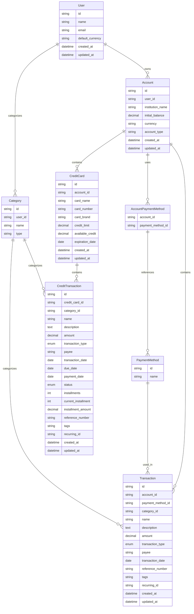

```mermaid
erDiagram
    User {
        string id
        string name
        string email
        string default_currency
        datetime created_at
        datetime updated_at
    }
    Account {
        string id
        string user_id
        string institution_name
        decimal initial_balance
        string currency
        string account_type
        datetime created_at
        datetime updated_at
    }
    Category {
        string id
        string user_id
        string name
        string type
    }
    PaymentMethod {
        string id
        string name
    }
    AccountPaymentMethod {
        string account_id
        string payment_method_id
    }
    CreditCard {
        string id
        string account_id
        string card_name
        string card_number
        string card_brand
        decimal credit_limit
        decimal available_credit
        date expiration_date
        datetime created_at
        datetime updated_at
    }
    Transaction {
        string id
        string account_id
        string payment_method_id
        string category_id
        string name
        text description
        decimal amount
        enum transaction_type
        string payee
        date transaction_date
        string reference_number
        string tags
        string recurring_id
        datetime created_at
        datetime updated_at
    }
    CreditTransaction {
        string id
        string credit_card_id
        string category_id
        string name
        text description
        decimal amount
        enum transaction_type
        string payee
        date transaction_date
        date due_date
        date payment_date
        enum status
        int installments
        int current_installment
        decimal installment_amount
        string reference_number
        string tags
        string recurring_id
        datetime created_at
        datetime updated_at
    }

    User ||--o{ Account : owns
    User ||--o{ Category : categorizes
    Account ||--o{ AccountPaymentMethod : uses
    AccountPaymentMethod ||--o{ PaymentMethod : references
    Account ||--o{ CreditCard : contains
    Account ||--o{ Transaction : contains
    PaymentMethod ||--o{ Transaction : used_in
    Category ||--o{ Transaction : categorizes
    CreditCard ||--o{ CreditTransaction : contains
    Category ||--o{ CreditTransaction : categorizes
``` 