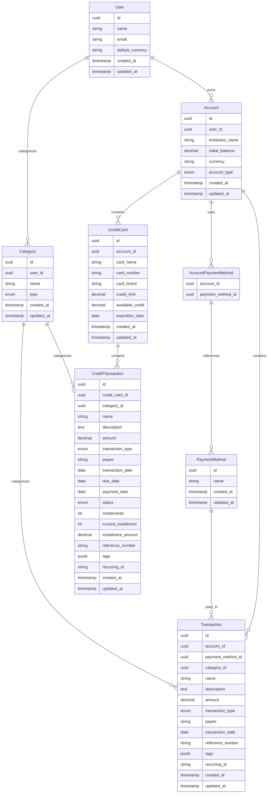

## Tipos de Dados PostgreSQL Utilizados

### Identificadores
- **UUID**: Para todos os IDs primários (mais seguro que auto-increment)
- **SERIAL**: Para sequências quando necessário

### Tipos Específicos
- **JSONB**: Para campos `tags` (mais eficiente que JSON para consultas)
- **ENUM**: Para tipos de conta, transação, status
- **TIMESTAMP**: Para campos de data/hora com timezone
- **DECIMAL**: Para valores monetários (precisão)

### Constraints PostgreSQL
- **CHECK**: Validação de formato de moeda (`^[A-Z]{3}$`)
- **UNIQUE**: Índices únicos em emails e nomes
- **FOREIGN KEY**: Com CASCADE DELETE para integridade referencial
- **NOT NULL**: Campos obrigatórios

### Índices Otimizados
- **B-tree**: Para consultas de igualdade e range
- **GIN**: Para consultas em campos JSONB
- **Hash**: Para consultas de igualdade simples
``` 